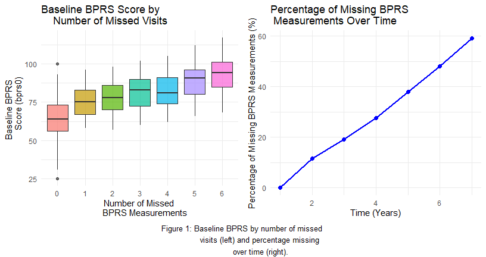
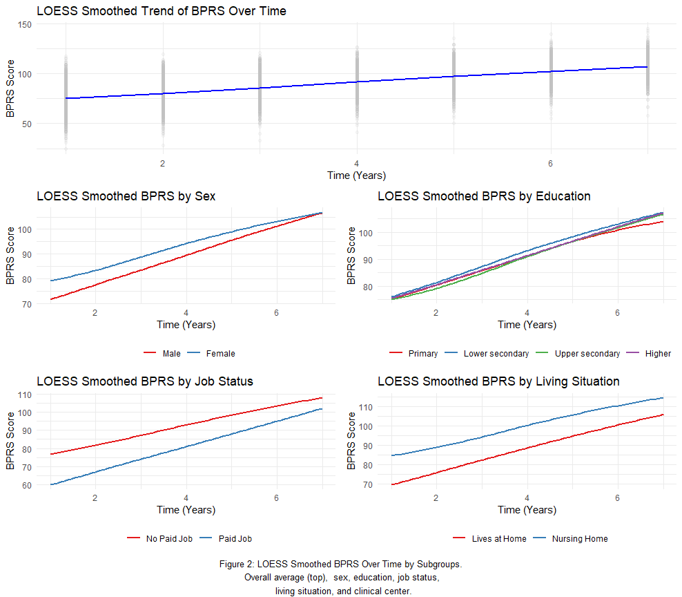
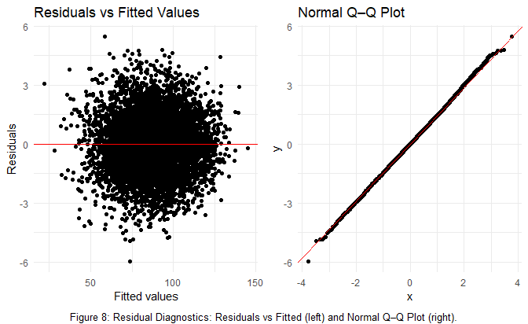
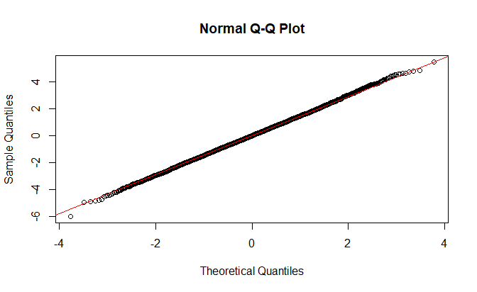
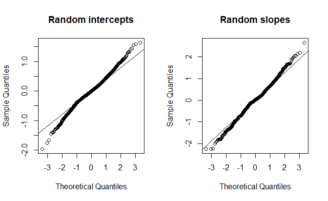
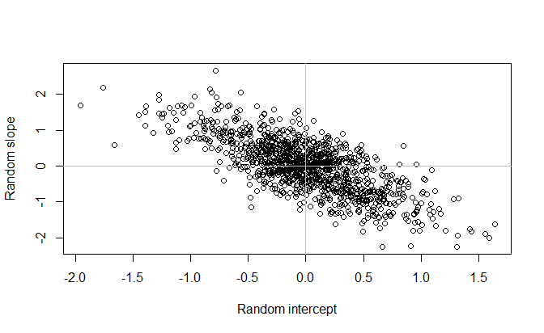
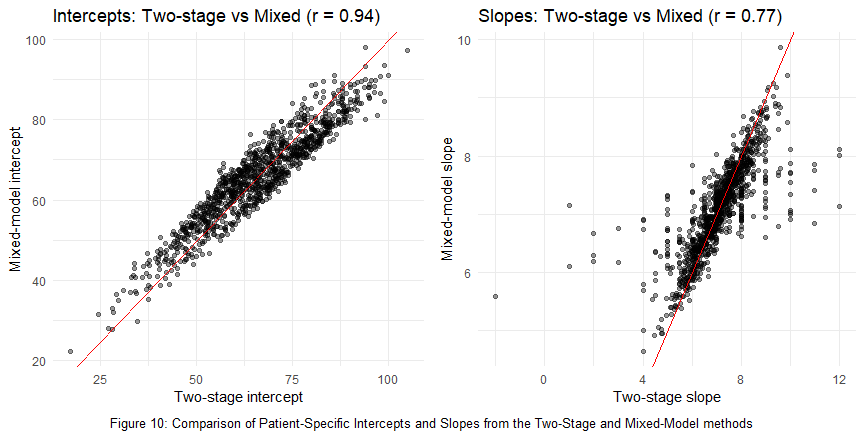
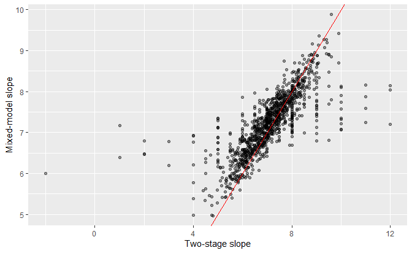
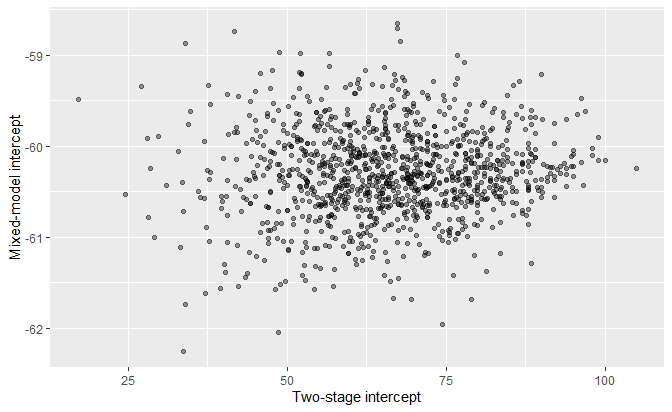

LDA Homework 1 (2025-2026)
================
  Student A (student number)  
Student B (student number)  
Student C (student number)  
Student D (student number)   

  
% replaces ‘color’

  
% optional

  
% optional

  
% for \[H\] (hold_position)

  
% if customizing header/footer

### Question 1

#### Check if Data is Balanced

From the description of the experiment we note that there is dropout
during follow up. Before using any summary methods to check the mean,
variancce and correlation structure we first check if the data is
balanced. We see that there is missingness in the data as shown in
figure 1 below. Patients with higher baseline BPRS scores tend to miss
more follow-up visits. There is also an increase of of the percentage of
missingness over time, reaching above 40% by year 6. Because simple by
time averages overweight those who remain and underrepresent those who
dropped out (patients with higher baseline BPRS scores), they can paint
an a biased trend if simple bprs by time averages are used. This pattern
suggests data are not missing completely at random, so we use smoothing
methods that are better suited for unbalanced data

<!-- -->

#### Zero-variance check for baseline Tau PET (taupet0)

From the table, taupet0 still varies through Year 2 (SD drops from 0.116
to 0.023), but from Year 3 onwards it has zero variance (only one unique
value among those with BPRS observed). That means taupet0 cannot explain
any between-patient differences after Year 2 and coefficients for those
years are not estimable. We should not use taupet0 from year 3 as this
variable would not provide information on growth trajectories from here
onwards.

#### Average loess smoothing

#### Categorical Variables

To explore potential subgroup differences, we create LOESS smoothed
plots of BPRS over time stratified by categorical variables: sex,
education, job status, living situation, and clinical center. Across
these variables, BPRS increases over time. Most subgroup curves are
roughly parallel, showing main effects without interactions for
variables like sex, job status, and living situation. The four education
categories overlap almost completely and there is no difference in
trend. This means there is unlikely a significant effect of education on
BPRS trajectory. Taupet also shows distinct level shifts with roughly
parallel trends, indicating a main effect without interaction. was a
variable with only one measurement where it was not missing hence a zero
variance variable.

<!-- -->

#### Continuous Variables

To explore continuous predictors, we plotted LOESS-smoothed BPRS against
age, BMI, baseline BPRS (bprs0), and baseline CDR-SB (cdrsb0), using
separate curves for each follow-up year. Higher age and higher baseline
BPRS are both consistently associated with higher BPRS at every visit.
BMI shows a curved pattern that peaks in the mid-20s, suggesting that a
non-linear term would describe it better than a straight line. Baseline
CDR-SB shows only a weak and slightly curved association with BPRS.

<!-- -->

#### Trial Centers Plot

To check whether clinical center (trial) affects the mean structure, we
plot(figure 4) LOESS-smoothed BPRS over time separately by trial centre.
We see clear separate curves between centers, indicating that trial
should be included as a random effect in the model to account for
between center variability.

<!-- -->

#### Variance & Correlation Structure

The smoothed squared residuals shows a flat residual curve, we dont
observe a heteroscedastic pattern, meaning the spread of patients BPR’s
readings tranjectory around there expected readings doesn’t change a
lot. The semi-variogram also rises with the time gap between
measurements, showing that observations from the same patient are more
similar when close together and become less similar as the gap widens.
These patterns indicate increasing variance over time and a clear
within-patient correlation that weakens with distance in time. Models
therefore need to allow for changing variances and a correlation
structure that decays over time. The plots are shown in figure 5 below.

<!-- -->

#### Question 1: Conclusions and modeling implications

- Mean structure: BPRS rises steadily over time. Subgroup curves are
  mostly parallel with level shifts by sex, job, living situation, and
  clear vertical shifts by clinical center; education shows little
  separation.
- Variance structure: The smoothed squared-residual function is roughly
  flat across visits (no visual heteroscedasticity observed). We will
  fit a model with un assumed heterogeneous variance and compare this
  with a constant variance model using AIC.
- Correlation structure: The semivariogram increases with time lag,
  indicating strong within-patient correlation at short lags that decays
  as visits are farther apart.
- Missingness: Dropout increases over time and is more common for
  patients with higher baseline BPRS, so simple time-point averages
  would be biased
- Modeling implications: For population-average inference, use repeated
  measures with with unstructured covariance structure and compare with
  AR(1) correlation
- For subject-specific inference, use a mixed model with patient random
  intercept and slope; include a random intercept for clinical center,
  because there is a clear clinical site differences  
- we don’t recommend using taupet 0 as a covariate in the model as it
  has zero variance from year 3 onwards, for the participants who’s BPRS
  measurement were taken at year 3 and beyond. It will not contribute to
  the model

#### R for mixed models

For all analysis and and especially repeated measures models we fit the
models in R using the nlme package for population-average analyses. For
these models we used `nlme::gls`a repeated-measures approach where we
specify the within-patient covariance (e.g., unstructured with
visit-specific variances or AR(1) with heterogeneity). This mirrors the
method used in SAS (PROC MIXED with a REPEATED statement): it estimates
average trajectories while properly accounting for the correlation
between a patient’s repeated observations, without introducing
individual random effects. For Question 5, where objective is to study
patient-specific trajectories, we used `lme4::lmer` to fit a mixed model
with random intercepts and random slopes, allowing each patient to have
their own baseline level and rate of change while still estimating the
overall population effects.

### Question 2

#### Individual profiles & per-patient slopes

To visualise heterogeneity in longitudinal evolution, BPRS trajectories
of 40 random patients were plotted. These individual profiles show
variation in baseline symptom severity, together with increasing trends
over time. The profiles also illustrate the unbalanced nature of the
data, as subjects contribute different numbers of observations. These
observations help justify the choice of summary statistics for
longitudinal data.

<!-- -->

#### Change Score Analysis

The change score is defined as the difference between the last observed
BPRS score and the baseline BPRS score for each patient. A linear model
is fitted to determine which baseline covariates predict this change.
The model is:

$$
\begin{aligned}
\text{ChangeScore}_i = & \beta_0 + \beta_1 \cdot \text{sex}_i + \beta_2 \cdot \text{age}_i + \beta_3 \cdot \text{bmi}_i + \beta_4 \cdot \text{job}_i + \beta_5 \cdot \text{adl}_i \\
& + \beta_6 \cdot \text{wzc}_i + \beta_7 \cdot \text{cdrsb0}_i + \beta_8 \cdot \text{abpet0}_i + \beta_9 \cdot \text{taupet0}_i + \epsilon_i
\end{aligned}
$$

where:

- $\text{ChangeScore}_i = \text{BPRS}_{\text{last}, i} - \text{BPRS}_{0, i}$
  for patient $i$.
- $\beta_0$ is the intercept: expected change for the reference
  individual (Male, No Paid Job, Lives at Home), with continuous
  covariates equal to 0.
- $\beta_1$ is the effect of sex on change: Female vs Male.
- $\beta_2$ is the effect of age on change: per 1-year increase.
- $\beta_3$ is the effect of BMI on change: per 1-unit increase.
- $\beta_4$ is the effect of job on change: Paid Job vs No Paid Job.
- $\beta_5$ is the effect of ADL on change: per 1-unit increase.
- $\beta_6$ is the effect of living situation (wzc) on change: Nursing
  Home vs Lives at Home.
- $\beta_7$ is the effect of baseline CDR-SB (cdrsb0) on change: per
  1-unit increase.
- $\beta_8$ is the effect of baseline Amyloid PET (abpet0) on change:
  per 1-unit increase.
- $\beta_9$ is the effect of baseline Tau PET (taupet0) on change: per
  1-unit increase.
- $\epsilon_i$ is the error term.

#### Separate analyses for each follow-up year

For each follow-up year $t \in \{1,\dots,6\}$, we fit an ordinary linear
model relating the BPRS score at year $t$ to baseline covariates:

$$
\begin{aligned}
  ext{BPRS}_{it} = &\; \alpha_{0t} + \alpha_{1t} \cdot \text{sex}_i + \alpha_{2t} \cdot \text{age}_i + \alpha_{3t} \cdot \text{bmi}_i + \alpha_{4t} \cdot \text{job}_i + \alpha_{5t} \cdot \text{adl}_i \\
& + \alpha_{6t} \cdot \text{wzc}_i + \alpha_{7t} \cdot \text{cdrsb0}_i + \alpha_{8t} \cdot \text{abpet0}_i + \alpha_{9t} \cdot \text{taupet0}_i + \varepsilon_{it} .
\end{aligned}
$$

where, for each fixed year $t$:

- $\alpha_{0t}$ is the expected BPRS at year $t$ for the reference
  patient (Male, No Paid Job, Lives at Home), with continuous covariates
  at 0.
- $\alpha_{1t}$ is the difference at year $t$ for Female vs Male.
- $\alpha_{2t}$ is the change at year $t$ per 1-year increase in age.
- $\alpha_{3t}$ is the change at year $t$ per 1-unit increase in BMI.
- $\alpha_{4t}$ is the difference at year $t$ for Paid Job vs No Paid
  Job.
- $\alpha_{5t}$ is the change at year $t$ per 1-unit increase in ADL.
- $\alpha_{6t}$ is the difference at year $t$ for Nursing Home vs Lives
  at Home.
- $\alpha_{7t}$ is the change at year $t$ per 1-unit increase in
  baseline CDR-SB (cdrsb0).
- $\alpha_{8t}$ is the change at year $t$ per 1-unit increase in
  baseline Amyloid PET (abpet0).
- $\alpha_{9t}$ is the change at year $t$ per 1-unit increase in
  baseline Tau PET (taupet0).
- $\varepsilon_{it}$ is the error term at year $t$.

### Question 3

#### Motivation Repeated-Measures Model

To estimate population effects, we use a repeated-measures multivariate
model. This approach treats each patient’s yearly BPRS readings as not
independent. A normal multivariate linear model assumes all observations
are independent, which is not realistic here because the same patient is
measured several times. The repeated-measures model correctly handles
the correlation within a person, the uneven follow-up due to dropout,
and the changing variability across visits.This model uses all available
data and gives more reliable averages and standard errors. We start from
a saturated repeated-measures model where time, all baseline
characteristics, and their interactions with time are included. This
gives every variable a way to influence both the starting BPRS level and
the change over time, so that we do not miss important effects when we
later simplify the model. For the repeated measurements within a
patient, we allow a very flexible pattern for how BPRS scores at
different visits are related to each other, without forcing a specific
correlation pattern in advance. We do not use this saturated model to
report final clinical results, we use it as a screening model and then
simplify the mean structure. In question 2 we had yearly results but
analysing each year separately would mean running several models for the
same question/hypothesis. This increases the chance of getting a
significant result just by chance (Type 1 error), because we are not
using all observations together it also leads to lower power. Separate
analyses also do not answer the main question of the study, which is how
BPRS changes over time and how baseline factors relate to that change.
They ignore that measurements from the same patient are correlated,
which can give misleading results. The repeated-measures model avoids
these problems by using all time points at once and by correctly
accounting for the fact that each patient contributes several,
correlated measurements.

$$
\begin{aligned}
E[Y_{ij} | \boldsymbol{X}_i] = & \beta_0 + \beta_1 \cdot \text{time}_{j} + \beta_2 \cdot \text{edu}_i + \beta_3 \cdot \text{sex}_i + \beta_4 \cdot \text{age}_i + \beta_5 \cdot \text{bmi}_i + \beta_6 \cdot \text{job}_i \\
& + \beta_7 \cdot \text{adl}_i + \beta_8 \cdot \text{wzc}_i + \beta_9 \cdot \text{cdrsb0}_i + \beta_{10} \cdot \text{abpet0}_i \\
& + \beta_{11} \cdot (\text{time}_{j} \times \text{sex}_i) + \beta_{12} \cdot (\text{time}_{j} \times \text{age}_i) + \beta_{13} \cdot (\text{time}_{j} \times \text{bmi}_i) \\
& + \beta_{14} \cdot (\text{time}_{j} \times \text{job}_i) + \beta_{15} \cdot (\text{time}_{j} \times \text{adl}_i) + \beta_{16} \cdot (\text{time}_{j} \times \text{wzc}_i) \\
& + \beta_{17} \cdot (\text{time}_{j} \times \text{cdrsb0}_i) + \beta_{18} \cdot (\text{time}_{j} \times \text{abpet0}_i)
\end{aligned}
$$

where:

- $Y_{ij}$ is the BPRS score for patient $i$ at time $j$.
- $\beta_0$ is the intercept: expected BPRS at time 0 for the reference
  patient (Male, Primary education, No Paid Job, Lives at Home), with
  continuous covariates at 0.
- $\beta_1$ is the main effect of time: average yearly change in BPRS
  for the reference patient.
- $\beta_2$ is the (vector of) main effect(s) of education: contrasts
  for Lower secondary, Upper secondary, and Higher vs Primary (written
  compactly as $\beta_2\,\text{edu}_i$).
- $\beta_3$ is the main effect of sex: Female vs Male at time 0.
- $\beta_4$ is the main effect of age: per 1-year increase at baseline.
- $\beta_5$ is the main effect of BMI: per 1-unit increase at baseline.
- $\beta_6$ is the main effect of job: Paid Job vs No Paid Job at time
  0.
- $\beta_7$ is the main effect of ADL: per 1-unit increase at baseline.
- $\beta_8$ is the main effect of living situation (wzc): Nursing Home
  vs Lives at Home at time 0.
- $\beta_9$ is the main effect of baseline CDR-SB (cdrsb0): per 1-unit
  increase at baseline.
- $\beta_{10}$ is the main effect of baseline Amyloid PET (abpet0): per
  1-unit increase at baseline.
- $\beta_{11}$ is the time-by-sex interaction: additional yearly change
  for Female vs Male.
- $\beta_{12}$ is the time-by-age interaction: modification of yearly
  change per 1-year increase in age.
- $\beta_{13}$ is the time-by-BMI interaction: modification of yearly
  change per 1-unit increase in BMI.
- $\beta_{14}$ is the time-by-job interaction: additional yearly change
  for Paid Job vs No Paid Job.
- $\beta_{15}$ is the time-by-ADL interaction: modification of yearly
  change per 1-unit increase in ADL.
- $\beta_{16}$ is the time-by-living situation (wzc) interaction:
  additional yearly change for Nursing Home vs Lives at Home.
- $\beta_{17}$ is the time-by-cdrsb0 interaction: modification of yearly
  change per 1-unit increase in baseline CDR-SB.
- $\beta_{18}$ is the time-by-abpet0 interaction: modification of yearly
  change per 1-unit increase in baseline Amyloid PET.

Notes: Categorical predictors (sex, edu, job, wzc) are encoded as
factors in R. Their coefficients represent contrasts relative to the
reference levels shown above; for education, the single symbol $\beta_2$
denotes a vector of three contrasts (levels 2–4 versus Primary).

The within-patient errors
$\boldsymbol{e}_i = (e_{i1}, \dots, e_{in_i})^T$ are assumed to follow a
multivariate normal distribution,
$\boldsymbol{e}_i \sim N(\boldsymbol{0}, \boldsymbol{\Sigma}_i)$, where
$\boldsymbol{\Sigma}_i$ is a covariance matrix that accounts for
correlation and heteroscedasticity. In this model, we use an
unstructured correlation matrix (`corSymm`) and allow for different
variances at each time point (`varIdent`).

Note: taupet0 terms (main effect and time interaction) were
intentionally excluded from this model due to near-zero variability at
later follow-up waves (see earlier diagnostic section), which prevents
stable estimation of their effects in a marginal mean model.

The complex repeated-measures model that includes time, all baseline
characteristics, and all their interactions with time, while allowing
for unstructured covariance structure. This complex model confirms that
BPRS increases over time and that age, BMI, ADL, job status, and living
in a nursing home are all related to BPRS levels. However, most of the
time-by-covariate interactions are small and not clearly different from
zero, which tells us we can safely move to a simpler mean structure
without losing important clinical information.

##### Simplified Mean Structure

For this step we fit a repeated-measures model with a simplified mean
structure but the same flexible covariance as before. In this model,
time and all main baseline characteristics except education remain in
the mean structure, and only one time interaction (time with baseline
CDR-SB) is kept. The estimated correlation matrix shows clear positive
correlation between repeated BPRS scores within a patient, especially
for visits that are closer in time, and the visit-specific standard
deviations increase from baseline to later years, contradicting with our
earlier variance plots showing homoscedastic variance. We will use this
reduced-mean, flexible-covariance model as the starting point when we
compare alternative, simpler covariance structures.

$$
\begin{aligned}
E[Y_{ij} | \boldsymbol{X}_i] = & \beta_0 + \beta_1 \cdot \text{time}_{j} + \beta_2 \cdot \text{sex}_i + \beta_3 \cdot \text{age}_i + \beta_4 \cdot \text{bmi}_i + \beta_5 \cdot \text{job}_i \\
& + \beta_6 \cdot \text{adl}_i + \beta_7 \cdot \text{wzc}_i + \beta_8 \cdot \text{cdrsb0}_i + \beta_{9} \cdot \text{taupet0}_i + \beta_{10} \cdot \text{abpet0}_i \\
& + \beta_{11} \cdot (\text{time}_{j} \times \text{cdrsb0}_i)
\end{aligned}
$$

where:

- $Y_{ij}$ is the BPRS score for patient $i$ at time $j$.
- $\beta_0$ is the intercept: expected BPRS at time 0 for the reference
  patient (Male, No Paid Job, Lives at Home), with continuous covariates
  at 0.
- $\beta_1$ is the main effect of time: average yearly change in BPRS
  for the reference patient.
- $\beta_2$ is the main effect of sex: Female vs Male at time 0.
- $\beta_3$ is the main effect of age: per 1-year increase at baseline.
- $\beta_4$ is the main effect of BMI: per 1-unit increase at baseline.
- $\beta_5$ is the main effect of job: Paid Job vs No Paid Job at time
  0.
- $\beta_6$ is the main effect of ADL: per 1-unit increase at baseline.
- $\beta_7$ is the main effect of living situation (wzc): Nursing Home
  vs Lives at Home at time 0.
- $\beta_8$ is the main effect of baseline CDR-SB (cdrsb0): per 1-unit
  increase at baseline.
- $\beta_9$ is the main effect of baseline Tau PET (taupet0): per 1-unit
  increase at baseline.
- $\beta_{10}$ is the main effect of baseline Amyloid PET (abpet0): per
  1-unit increase at baseline.
- $\beta_{11}$ is the time-by-cdrsb0 interaction: modification of yearly
  change per 1-unit increase in baseline CDR-SB.

The covariance structure remains the same as in the full model.

##### LR test between full and reduced mean structure models

The likelihood ratio test compares the complex mean structure model
(with all time–covariate interactions) to the reduced model (only time
$\times$ CDR-SB). The test statistic is 13.78 with a p-value of 0.25,
which means there is no evidence that the extra interaction terms
improve the fit. This shows the simpler mean structure explains the data
just as well as the saturated one, while using fewer parameters, so we
keep the reduced model as our working mean structure.

#### Reduced Covariance Structure

For this step, we keep the same simplified mean structure and only
change how we model the correlation over time. The aim is to check
whether a simpler covariance structure is sufficient. We fit a
repeated-measures model with an AR(1) correlation, where each visit is
mostly correlated with the previous one and the correlation weakens as
the time gap increases. We still allow variability to differ by visit.
Clinically, this means measurements taken close in time tend to be
similar, and later visits show more spread, but the structure is quite
restricted.

When we compare this AR(1) model to the more flexible model with a fully
general correlation matrix, the likelihood ratio test shows (L.Ratio
$\approx 1233$, $p < 0.0001$) and AIC/BIC worsen for AR(1). This
indicates that the data pattern is too complex to be captured by this
simpler correlation structure, so for population-average inference we
keep the more flexible covariance from the previous model.

##### Reduced mean structure vs reduced covariance structure

#### Discussion of Question 3 Results

For Question 3, our final repeated-measures model uses a reduced mean
structure with a flexible covariance. On the mean side, BPRS increases
on average by about 7 points per year. After adjustment, higher age,
higher BMI, worse ADL, having no paid job, and living in a nursing home
are all associated with higher BPRS levels, while women have slightly
lower BPRS than men. Baseline CDR-SB itself has little effect on the
level, but the time×CDR-SB term is clearly negative: patients who start
with better cognition tend to show a faster increase in BPRS, whereas
those who already have worse cognition at baseline worsen more slowly.
This directly answers our main question at the population level: BPRS
worsens over time, and the speed of worsening depends on baseline
cognitive status.

For the biomarkers, we focus on ABPET0 and CDR-SB. ABPET0 is retained in
the marginal model, but its coefficient is small and the confidence
interval is wide, so its association with BPRS is modest and uncertain.
The LOESS plot of BPRS versus ABPET0 by visit year shows an unstable
curved pattern, with a pronounced bump at year 3 that is not repeated at
other visits, which supports the idea that ABPET0 does not have a
simple, consistent relationship with BPRS over time. TAUPET0, on the
other hand, was dropped: from year 3 onwards it shows almost no
variability, so it cannot meaningfully explain differences in BPRS.
Given the objective of finding a parsimonious model that captures the
main drivers of BPRS change, we therefore treat ABPET0 as a possible but
weak biomarker signal and rely mainly on baseline CDR-SB (and its
interaction with time) to describe how baseline cognition is linked to
the BPRS trajectory.

The covariance part of the model lets each visit have its own
variability and allows all time points within a patient to be correlated
without imposing a simple pattern. This matches what we saw in the
exploratory plots: repeated BPRS measurements from the same patient are
strongly related, especially when visits are close in time, and the
spread increases over follow-up. Using this flexible structure gives
more realistic standard errors for the population averages.

Finally, this marginal model has some limitations compared with a
mixed-effects model. It provides population-average effects but not
patient-specific trajectories, and it does not explicitly model
differences between clinical centres. The LOESS plot by centre shows
centres with roughly parallel but clearly shifted curves, suggesting
real centre-level differences in BPRS levels over time. In the current
model, this extra variation is absorbed into the residual covariance
rather than being separated out. In Question 5 we therefore move to a
mixed-effects model with random intercepts and slopes for patients, and
a random intercept for trial, to better describe individual and
centre-specific disease trajectories while still addressing the main
objective: how BPRS changes over time, and how those changes relate to
baseline clinical characteristics, cognition, and biomarkers.

### Question 4

In the first stage of a two-stage analysis, we fit a separate linear
regression model for each patient to estimate their individual intercept
and slope over time. For each patient $i$, the model is:

$$
Y_{ij} = \beta_{0i} + \beta_{1i} \cdot \text{time}_j + e_{ij}
$$

where:

- $Y_{ij}$ is the BPRS score for patient $i$ at time $j$.
- $\beta_{0i}$ is the patient-specific intercept (estimated baseline
  BPRS).
- $\beta_{1i}$ is the patient-specific slope (estimated rate of change
  in BPRS).
- $e_{ij}$ are the individual error terms, assumed to be independent
  with mean zero.

<!-- -->

#### Stage 2: Relate Intercepts and Slopes to Covariates

##### Model for the Intercepts

In the second stage, we model the estimated patient-specific intercepts
($\hat{\beta}_{0i}$) as a function of baseline covariates to understand
which factors predict the initial BPRS score. The model is:

$$
\begin{aligned}
\hat{\beta}_{0i} = & \gamma_{00} + \gamma_{01} \cdot \text{sex}_i + \gamma_{02} \cdot \text{age}_i + \gamma_{03} \cdot \text{bmi}_i + \gamma_{04} \cdot \text{job}_i + \gamma_{05} \cdot \text{adl}_i \\
& + \gamma_{06} \cdot \text{wzc}_i + \gamma_{07} \cdot \text{cdrsb0}_i + \gamma_{08} \cdot \text{abpet0}_i + \gamma_{09} \cdot \text{taupet0}_i + \epsilon_{0i}
\end{aligned}
$$

where:

- $\hat{\beta}_{0i}$ is the estimated intercept for patient $i$ from
  Stage 1.
- $\gamma_{00}$ is the average intercept for the reference individual
  (Male, No Paid Job, Lives at Home), with continuous covariates at 0.
- $\gamma_{01}$ is the intercept difference for Female vs Male.
- $\gamma_{02}$ is the intercept change per 1-year increase in age.
- $\gamma_{03}$ is the intercept change per 1-unit increase in BMI.
- $\gamma_{04}$ is the intercept difference for Paid Job vs No Paid Job.
- $\gamma_{05}$ is the intercept change per 1-unit increase in ADL.
- $\gamma_{06}$ is the intercept difference for Nursing Home vs Lives at
  Home.
- $\gamma_{07}$ is the intercept change per 1-unit increase in baseline
  CDR-SB (cdrsb0).
- $\gamma_{08}$ is the intercept change per 1-unit increase in baseline
  Amyloid PET (abpet0).
- $\gamma_{09}$ is the intercept change per 1-unit increase in baseline
  Tau PET (taupet0).
- $\epsilon_{0i}$ is the error term.

#### Model for the Slopes

Similarly, we model the estimated patient-specific slopes
($\hat{\beta}_{1i}$) as a function of baseline covariates to see what
predicts the rate of change in BPRS. The model is:

$$
\begin{aligned}
\hat{\beta}_{1i} = & \gamma_{10} + \gamma_{11} \cdot \text{sex}_i + \gamma_{12} \cdot \text{age}_i + \gamma_{13} \cdot \text{bmi}_i + \gamma_{14} \cdot \text{job}_i + \gamma_{15} \cdot \text{adl}_i \\
& + \gamma_{16} \cdot \text{wzc}_i + \gamma_{17} \cdot \text{cdrsb0}_i + \gamma_{18} \cdot \text{abpet0}_i + \gamma_{19} \cdot \text{taupet0}_i + \epsilon_{1i}
\end{aligned}
$$

where:

- $\hat{\beta}_{1i}$ is the estimated slope for patient $i$ from Stage
  1.
- $\gamma_{10}$ is the average slope for the reference individual (Male,
  No Paid Job, Lives at Home), with continuous covariates at 0.
- $\gamma_{11}$ is the slope difference for Female vs Male.
- $\gamma_{12}$ is the slope change per 1-year increase in age.
- $\gamma_{13}$ is the slope change per 1-unit increase in BMI.
- $\gamma_{14}$ is the slope difference for Paid Job vs No Paid Job.
- $\gamma_{15}$ is the slope change per 1-unit increase in ADL.
- $\gamma_{16}$ is the slope difference for Nursing Home vs Lives at
  Home.
- $\gamma_{17}$ is the slope change per 1-unit increase in baseline
  CDR-SB (cdrsb0).
- $\gamma_{18}$ is the slope change per 1-unit increase in baseline
  Amyloid PET (abpet0).
- $\gamma_{19}$ is the slope change per 1-unit increase in baseline Tau
  PET (taupet0).
- $\epsilon_{1i}$ is the error term.

### Question 5

##### Plausible random effects model

To understand how psychiatric symptoms evolve over time in Alzheimer’s
disease, we developed a statistical model that accounts for repeated
measurements in each patient. This model allows each patient to have
their own starting level of symptoms and their own rate of change over
time. The outcome of interest was the Brief Psychiatric Rating Scale
(BPRS), measured annually over six years.

We model the longitudinal BPRS scores using a linear mixed-effects model
with random effects at both the patient and trial level:

$$
\text{BPRS}_{it} =
(\beta_0 + b_{0i} + u_{0j})
+ (\beta_1 + b_{1i})\,\text{time}_{it}
+ \beta_2 \text{sex}_i
+ \beta_3 \text{age}_i
+ \beta_4 \text{bmi}_i
+ \beta_5 \text{job}_i
+ \beta_6 \text{adl}_i
+ \beta_7 \text{wzc}_i
+ \beta_8 \text{cdrsb0}_i
+ \beta_9 (\text{time}_{it} \cdot \text{cdrsb0}_i)
+ \epsilon_{it}
$$

where:

- $\text{BPRS}_{it}$ is the BPRS score for patient $i$ in trial $j$ at
  time $t$  
- $\beta_0, \dots, \beta_9$ are **fixed (population-level) effects**  
- $b_{0i}$ is the **patient-specific random intercept**  
- $b_{1i}$ is the **patient-specific random slope** for time  
- $u_{0j}$ is the **trial-specific random intercept**  
- $\epsilon_{it}$ is the **residual error term**

The patient-level random effects are assumed to follow a bivariate
normal distribution:

$$
\begin{pmatrix}
b_{0i} \\
b_{1i}
\end{pmatrix}
\sim
N\!\left(
\begin{pmatrix}
0 \\
0
\end{pmatrix},
\begin{pmatrix}
\sigma_{b0}^{2} & \sigma_{b0,b1} \\
\sigma_{b0,b1} & \sigma_{b1}^{2}
\end{pmatrix}
\right),
$$

and the trial-level random intercept follows:

$$
u_{0j} \sim N(0, \sigma_{\text{trial}}^{2}).
$$

###### Model Motivation and Justification

Here, We chose to fit linear mixed effects model because the dataset
contains repeated BPRS measurements for the same patients over 6 years
and across multiple clinical trials, with clear variability both in
baseline symptom severity and rate of change between patients. This
model was appropriate because it:

1)  Explicitly accounts for correlation within patients (repeated
    measures from the same individual),

2)  Allows patient-specific trajectories (subject-specific intercepts
    and slopes),

3)  Uses all available data, including patients with incomplete
    follow-up.

4)  and Adjusts the individual trajectories for baseline patient
    characteristics, improving precision.

###### Choice of Technique

An unstructured covariance matrix was used for the random effects,
allowing the intercept and slope to be correlated. The model included:

1)  Random intercepts and random slopes for each patient, reflecting
    that individuals differ both in their baseline psychiatric symptom
    severity and in their rate of change over time.
2)  A random intercept for trial was added to account for systematic
    differences across the 25 clinical trials.
3)  Fixed effects included all clinically relevant baseline covariates
    (age, sex, BMI, job status, ADL, living situation, CDR-SB, amyloid
    PET), ensuring adjustment for major patient characteristics.
4)  An interaction term between time × CDRSB was included to assess
    whether cognitive impairment at baseline affects the rate of
    psychiatric symptom progression.

###### Estimation Method

The model was fitted using Restricted Maximum Likelihood (REML), which
provides unbiased and stable estimates of variance components,
especially because our dataset had many clusters (patients, trials).We
also preferred this (REML)for comparing models that differ in their
random-effects structure.

###### Assumptions made

1)  Linearity: BPRS changes linearly over the follow-up period.

2)  Normality: Random effects and residual errors are approximately
    normally distributed.

3)  Independence: After accounting for random effects, residuals are
    independent.

4)  Missing data (dropout) are at least missing at random (MAR)
    conditional on the covariates and random effects.

5)  Correct Covariance Structure: The random intercept–slope covariance
    captures individual variability adequately

###### Advantages

1)  Properly accounts for correlation between repeated measures within
    patients.
2)  Handles unbalanced data, allowing inclusion of patients with
    incomplete follow-up.
3)  Produces subject-specific predictions (intercepts and slopes).
4)  The model incorporates trial-level variability, improving
    generalizability.
5)  More efficient and less biased than two-stage or marginal models for
    this scientific question.

###### Disadvantages / Potential Problems

1)  More complex to interpret for non-statisticians.

2)  Results depend on correct specification of random-effects structure.

3)  Convergence issues can arise with complex models.

4)  Assumptions such as normality of random effects and linearity may
    not fully hold in real data.

5)  MAR assumption cannot be fully verified.

##### Diagnostics: Evaluating Model Appropriateness

To ensure that the linear mixed-effects model is statistically reliable,
several diagnostic checks were performed. These checks help determine
whether the model’s assumptions are met, and whether the results are
reliable.

###### Normality of Residuals (Q–Q Plot)

The Q–Q plot compares the distribution of the model residuals (errors)
to what would be expected if they followed a normal distribution, which
is an underlying assumption of linear mixed-effects models.The residuals
aligned closely with the expected diagonal pattern, showing only small
deviations at the tails.The assumption of normally distributed residuals
is largely satisfied. This supports the reliability of the estimated
effects.

<!-- --><!-- -->

###### Residuals vs. Fitted Values Plot

This plot assesses whether residuals are randomly distributed around
zero, which reflects the assumption of constant variability
(“homoscedasticity”).Residuals are spread evenly around zero with no
funnel shape or curvature. This indicates Variance is stable across
time, The model does not systematically under- or over-predict symptoms
and The linearity assumption is appropriate. The model fits the data
well and the variability is appropriately captured.

###### Distribution of Patient-Specific Intercepts and Slopes

To evaluate whether the random-effects model appropriately captured
differences between patients, we examined the distribution of the
estimated subject-specific intercepts (patients’ baseline BPRS scores)
and subject-specific slopes (their rates of symptom change over time).
The distribution of intercepts showed some variability, indicating that
patients entered the study with a wide range of psychiatric severity
levels. The slopes also displayed meaningful variation, reflecting that
some patients deteriorated faster than others, while a smaller number
showed relatively stable symptoms. Both the intercepts and slopes
followed approximately normal distributions, with no evidence of heavy
tails or extreme outliers. This pattern supports the model assumptions
and confirms that the random-effects component is performing as expected
accurately capturing differences between patients rather than noise.
Overall, the distributions validate the appropriateness of including
random intercepts and random slopes in the model.

<!-- --><!-- -->

Overall, All diagnostic checks support the validity of the linear
mixed-effects model:The residuals behave well (normal distribution and
constant variance), The model captures both average disease progression
and patient-specific trajectories, The variability across patients
justifies including both random intercepts and slopes and The model
provides more precise estimates than the two-stage approach and is more
statistically efficient.

##### Comparison With the Two-Stage Analysis

To better understand how each patient’s symptoms (BPRS scores) change
over time, we estimated individual starting points (intercepts) and
rates of change (slopes) in two different ways: 1) Two-stage approach ,
running a separate linear regression for each patient.(Question 4) 2)
Random-effects mixed model using all patients’ data together while
allowing each patient to have their own intercept and slope.

We then compared the two methods to see whether the more advanced mixed
model provides meaningful improvement.

**Subject-specific intercepts and slopes from mixed model vs two-stage
estimates**
<!-- -->

    ## [1] 0.07416293

    ## [1] 0.762492

<!-- --><!-- -->

**Do both methods give similar patient-specific results?**

Yes. When we compared the patient-specific results, we found the
two-stage method and the mixed-effects model produced similar
patient-specific results. The intercepts (baseline BPRS levels) showed a
strong correlation between the two approaches(Figrure 4), indicating
that both methods identify the same patients as starting with higher or
lower psychiatric severity. Likewise, the individual slopes (rates of
symptom change) were strongly positively correlated, demonstrating
agreement about which patients deteriorate faster or more slowly over
time. This was visually confirmed in the scatterplots (Figure 5), where
most points lay close to the 45-degree line of perfect agreement.
Together, these findings show that the mixed-effects model and the
two-stage analysis yield consistent subject-level estimates, although
the mixed model provides them in a more stable and statistically robust
way.

**Why are the mixed-model estimates still preferred?**

Even though the two methods produce similar values, the mixed model is
statistically preferred for several reasons:

1)  It uses all available data efficiently

The mixed model:Handles patients with different numbers of visits,
Corrects for measurement error and Shrinks extreme individual estimates
toward the population average (reducing noise)

2)  It adjusts for all predictors The two-stage approach cannot adjust
    for these characteristics when estimating patient-level slopes. The
    mixed model does this automatically.
3)  It accounts for correlation within patients Longitudinal data
    contain repeated measures from the same person. The mixed model
    captures the dependency between these repeated measurements; the
    two-stage method does not.

Thus, In summary, the random-effects mixed model proved to be the most
appropriate and clinically meaningful approach for analyzing individual
trajectories in BPRS scores. The model captured substantial and
realistic variation between patients in both their baseline psychiatric
severity and their rate of symptom progression. Model diagnostics
confirmed that the assumptions of the mixed model were met, with
residuals and random effects showing acceptable distributions. When
compared to the simpler two-stage method, the mixed model produced
highly consistent patient-specific intercepts and slopes, but with
greater stability and less sensitivity to noise or sparse data.
Furthermore, the mixed model has important advantages: it uses all
available information, adjusts individual estimates for relevant
clinical predictors, and correctly handles the correlation of repeated
measurements within patients. Overall, the random-effects model provides
the most robust, reliable, and interpretable description of both
population-level trends and individual differences in psychiatric
symptom trajectories in this Alzheimer’s cohort.

##### Results

<table class="table table" style="font-size: 9px; margin-left: auto; margin-right: auto; margin-left: auto; margin-right: auto;">
<thead>
<tr>
<th style="text-align:left;">
effect
</th>
<th style="text-align:right;">
term
</th>
<th style="text-align:right;">
estimate
</th>
<th style="text-align:right;">
std.error
</th>
<th style="text-align:right;">
statistic
</th>
<th style="text-align:left;">
p.value
</th>
</tr>
</thead>
<tbody>
<tr>
<td style="text-align:left;">
fixed
</td>
<td style="text-align:right;width: 5cm; ">
(Intercept)
</td>
<td style="text-align:right;">
-60.29 \[ -68.48, -52.11\]
</td>
<td style="text-align:right;">
4.17
</td>
<td style="text-align:right;">
-14.46
</td>
<td style="text-align:left;">
\<0.01
</td>
</tr>
<tr>
<td style="text-align:left;">
fixed
</td>
<td style="text-align:right;width: 5cm; ">
time
</td>
<td style="text-align:right;">
7.22 \[ 7.14, 7.30\]
</td>
<td style="text-align:right;">
0.04
</td>
<td style="text-align:right;">
179.32
</td>
<td style="text-align:left;">
\<0.01
</td>
</tr>
<tr>
<td style="text-align:left;">
fixed
</td>
<td style="text-align:right;width: 5cm; ">
sexFemale
</td>
<td style="text-align:right;">
-0.16 \[ -0.33, 0.01\]
</td>
<td style="text-align:right;">
0.09
</td>
<td style="text-align:right;">
-1.84
</td>
<td style="text-align:left;">
0.07
</td>
</tr>
<tr>
<td style="text-align:left;">
fixed
</td>
<td style="text-align:right;width: 5cm; ">
age
</td>
<td style="text-align:right;">
1.70 \[ 1.62, 1.78\]
</td>
<td style="text-align:right;">
0.04
</td>
<td style="text-align:right;">
42.36
</td>
<td style="text-align:left;">
\<0.01
</td>
</tr>
<tr>
<td style="text-align:left;">
fixed
</td>
<td style="text-align:right;width: 5cm; ">
bmi
</td>
<td style="text-align:right;">
0.18 \[ 0.12, 0.23\]
</td>
<td style="text-align:right;">
0.03
</td>
<td style="text-align:right;">
6.54
</td>
<td style="text-align:left;">
\<0.01
</td>
</tr>
<tr>
<td style="text-align:left;">
fixed
</td>
<td style="text-align:right;width: 5cm; ">
jobPaid Job
</td>
<td style="text-align:right;">
-5.14 \[ -6.71, -3.56\]
</td>
<td style="text-align:right;">
0.80
</td>
<td style="text-align:right;">
-6.39
</td>
<td style="text-align:left;">
\<0.01
</td>
</tr>
<tr>
<td style="text-align:left;">
fixed
</td>
<td style="text-align:right;width: 5cm; ">
adl
</td>
<td style="text-align:right;">
0.07 \[ -0.17, 0.30\]
</td>
<td style="text-align:right;">
0.12
</td>
<td style="text-align:right;">
0.55
</td>
<td style="text-align:left;">
0.58
</td>
</tr>
<tr>
<td style="text-align:left;">
fixed
</td>
<td style="text-align:right;width: 5cm; ">
wzcNursing Home
</td>
<td style="text-align:right;">
1.92 \[ 1.72, 2.11\]
</td>
<td style="text-align:right;">
0.10
</td>
<td style="text-align:right;">
19.56
</td>
<td style="text-align:left;">
\<0.01
</td>
</tr>
<tr>
<td style="text-align:left;">
fixed
</td>
<td style="text-align:right;width: 5cm; ">
cdrsb0
</td>
<td style="text-align:right;">
0.00 \[ -0.01, 0.02\]
</td>
<td style="text-align:right;">
0.01
</td>
<td style="text-align:right;">
0.26
</td>
<td style="text-align:left;">
0.79
</td>
</tr>
<tr>
<td style="text-align:left;">
fixed
</td>
<td style="text-align:right;width: 5cm; ">
time:cdrsb0
</td>
<td style="text-align:right;">
-0.02 \[ -0.03, -0.01\]
</td>
<td style="text-align:right;">
0.00
</td>
<td style="text-align:right;">
-5.25
</td>
<td style="text-align:left;">
\<0.01
</td>
</tr>
</tbody>
</table>

The linear mixed-effects model was fitted to 6,220 observations from
1,253 patients across 25 trials. The model included random intercepts
and slopes for patients and a random intercept for trial. The REML
criterion at convergence was 27,121.3, and scaled residuals ranged from
−3.64 to 3.32. The patient-level random intercept variance was 0.81, the
patient-level random slope variance was 0.69, and the trial-level
intercept variance was 8.00; the residual variance was 2.70. The
correlation between patient-specific intercepts and slopes was −0.61.

For the fixed effects, the intercept estimate was −60.29 (SE = 4.17, p
\< 0.001). Time had an estimated coefficient of 7.22 (SE = 0.04, p \<
0.001). The effect of female sex was −0.16 (SE = 0.09, p = 0.0665), and
age had an estimate of 1.70 (SE = 0.04, p \< 0.001). BMI had an
estimated coefficient of 0.18 (SE = 0.03, p \< 0.001), while being in
paid employment had a coefficient of −5.14 (SE = 0.80, p \< 0.001). The
ADL score estimate was 0.07 (SE = 0.12, p = 0.5791). Nursing home
residence had an estimate of 1.92 (SE = 0.10, p \< 0.001). Baseline
CDRSB had an estimate of 0.002 (SE = 0.008, p = 0.7924). The interaction
between time and baseline CDRSB was −0.022 (SE = 0.004, p \< 0.001).

##### Summary Conclusion to a clinician

Using a mixed-effects model, we examined how psychiatric symptoms change
over time in patients with Alzheimer’s disease. This modelling approach
accounts for individual differences in both baseline symptom severity
and rates of progression.

The analysis showed that psychiatric symptoms worsen steadily over time,
with patients on average increasing by about 7 BPRS points per year.
However, not all patients start at the same level or decline at the same
speed. Our model captured this variation and revealed important patient
characteristics that help explain these differences.

Patients who were older, had higher BMI, poorer daily functioning (ADL),
lived in a nursing home, or did not have a paid job tended to have more
severe psychiatric symptoms at baseline. In addition, patients with more
impaired cognition at diagnosis (higher CDR-SB) showed faster worsening
of psychiatric symptoms over time. PET biomarkers for amyloid did not
significantly improve prediction beyond these clinical measures.

Overall, this approach provides a detailed picture of how psychiatric
symptoms evolve in Alzheimer’s disease. It shows which baseline factors
are linked with faster decline, and it gives individualized estimates of
symptom progression. These findings can help to better understand
patient variability, identify patients who may be at higher risk for
rapid deterioration, and guide monitoring and care strategies over the
course of the disease.

##### Reflection on parameterization

The chosen parameterization had two main components:

Mean structure (fixed effects): We specified a linear effect of time,
adjusted for sex, age, BMI, job status, ADL, nursing home residence
(WZC), baseline CDR-SB, tau PET, amyloid PET, and the interaction
between time and CDR-SB. This reflects a clinical hypothesis that:

1)  symptom severity depends on demographic, functional, and disease
    severity markers at baseline, and

2)  cognitive status modifies the trajectory of psychiatric symptoms
    (time × CDRSB0).

A key simplification is assuming a linear trajectory in time; in
reality, progression could be non-linear (e.g., faster early or late).
If time effects are non-linear, a model with splines or time as a factor
could fit better, but at the cost of interpretability and more
parameters.

Covariance structure (random effects): We chose random intercepts and
random slopes for time at the patient level, with an unstructured 2×2
covariance matrix. This is a very interpretable parameterization: one
parameter for variability in baseline severity, one for variability in
slope, and one for their correlation. Compared with fully unstructured
residual covariance (as in the GLS model), this is more parsimonious and
more directly linked to clinical ideas like “patients start differently”
and “patients change at different speeds”.

The model therefore strikes a balance between flexibility (allowing
heterogeneity in trajectories) and interpretability (simple linear time,
clinically meaningful random effects). In future, we might consider
testing alternative parameterizations (e.g., non-linear time, random
effects on additional covariates) but for this dataset, the chosen
structure appears adequate and clinically interpretable.

##### Recommendations for future similar experiments

From a modeling and design perspective, several recommendations emerge:

1)  systematic recording of dropout reasons: Since dropout can bias
    longitudinal analyses, future studies should routinely document why
    patients leave the study (death, institutionalization, refusal,
    health decline). This would allow sensitivity analyses under
    different missing-data assumptions (MAR vs MNAR).

2)  Richer covariate information on treatment and care: Including
    medication use (e.g., antipsychotics, antidepressants), psychosocial
    interventions, caregiver burden, and comorbidities might help
    explain additional between-patient variation and could identify
    modifiable risk factors for rapid deterioration.

3)  Parallel assessment of multiple outcome domains Since cognition,
    function, and psychiatric symptoms are closely related in
    Alzheimer’s disease, future experiments could be designed to jointly
    model these domains rather than analyzing each in isolation. This
    would provide a more integrated picture of disease progression and
    may better inform clinical decision-making.

##### Variance components from mixed model
