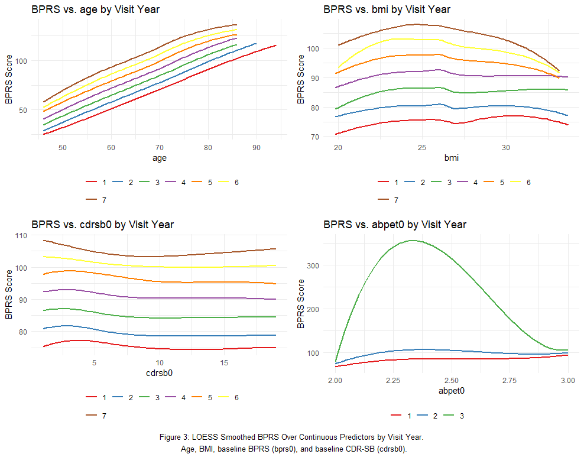
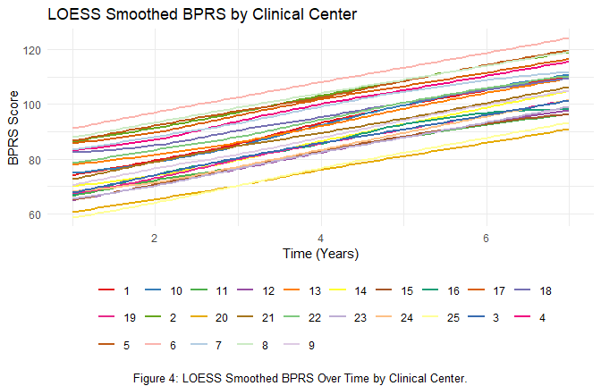
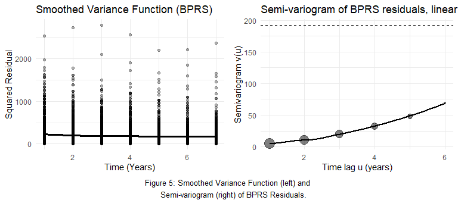
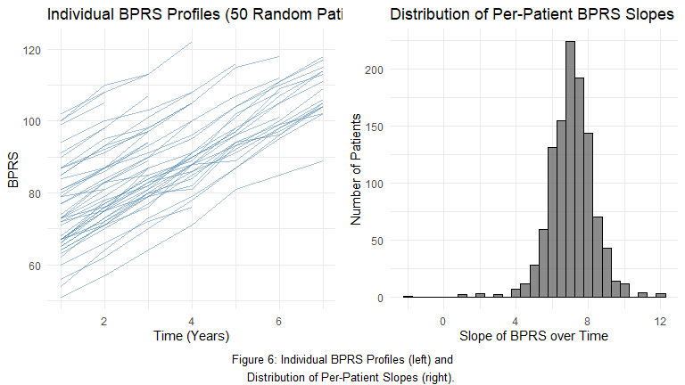
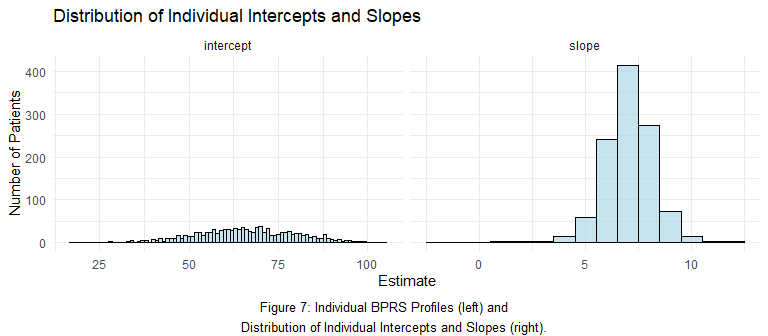
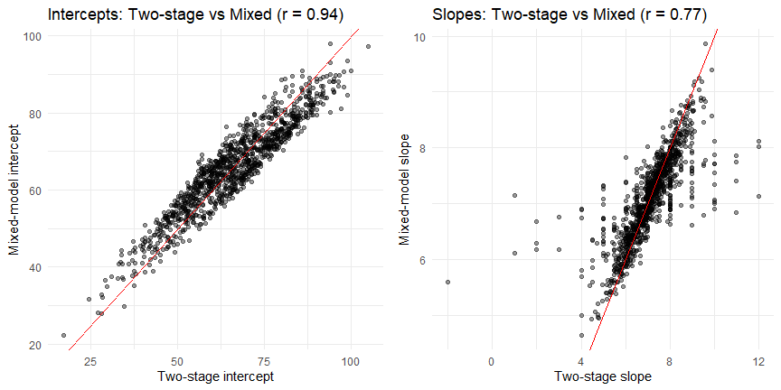

LDA Homework 1 (2025-2026)
================
  Student A (student number)  
Student B (student number)  
Student C (student number)  
Student D (student number)   

  
% replaces ‘color’

  
% optional

  
% optional

  
% for \[H\] (hold_position)

  
% if customizing header/footer

### Question 1

#### Check if Data is Balanced

From the description of the experiment we note that there is dropout
during follow up. Before using any summary methods to check the mean,
variancce and correlation structure we first check if the data is
balanced. We see that there is missingness in the data as shown in
figure 1 below. Patients with higher baseline BPRS scores tend to miss
more follow-up visits. There is also an increase of of the percentage of
missingness over time, reaching above 40% by year 6. Because simple by
time averages overweight those who remain and underrepresent those who
dropped out (patients with higher baseline BPRS scores), they can paint
an overly optimistic trend. This pattern suggests data are not missing
completely at random, so we use smoothing methodsthat remain robust to
missing data.

<!-- -->

#### Zero-variance check for baseline Tau PET (taupet0)

From the table, taupet0 still varies through Year 2 (SD drops from 0.116
to 0.023), but from Year 3 onwards it has zero variance (only one unique
value among those with BPRS observed). That means taupet0 cannot explain
any between-patient differences after Year 2 and coefficients for those
years are not estimable. We should not use taupet0 from year 3 as this
variable would not provide information on growth trajectories from here
onwards.

#### Average loess smoothing

#### Categorical Variables

To explore potential subgroup differences, we create LOESS smoothed
plots of BPRS over time stratified by categorical variables: sex,
education, job status, living situation, and clinical center. Across
these variables, BPRS increases over time. Most subgroup curves are
roughly parallel, showing main effects without interactions for
variables like sex, job status, and living situation. The four education
categories overlap almost completely and there is no difference in
trend. This means there is unlikely a significant effect of education on
BPRS trajectory. Taupet also shows distinct level shifts with roughly
parallel trends, indicating a main effect without interaction. was a
variable with only one measurement where it was not missing hence a zero
variance variable.

<!-- -->

#### Continuous Variables

To explore continuous predictors, we plotted LOESS-smoothed BPRS against
age, BMI, baseline BPRS (bprs0), and baseline CDR-SB (cdrsb0), using
separate curves for each follow-up year. Higher age and higher baseline
BPRS are both consistently associated with higher BPRS at every visit.
BMI shows a curved pattern that peaks in the mid-20s, suggesting that a
non-linear term would describe it better than a straight line. Baseline
CDR-SB shows only a weak and slightly curved association with BPRS.

<!-- -->

#### Trial Centers Plot

To check whether clinical center (trial) affects the mean structure, we
plot(figure 4) LOESS-smoothed BPRS over time separately by trial centre.
We see clear separate curves between centers, indicating that trial
should be included as a random effect in the model to account for
between center variability.

<!-- -->

#### Variance & Correlation Structure

The smoothed squared residuals shows a flat residual curve, we dont
observe a heteroscedastic pattern, meaning the spread of patients BPR’s
readings tranjectory around there expected readings doesn’t change a
lot. The semi-variogram also rises with the time gap between
measurements, showing that observations from the same patient are more
similar when close together and become less similar as the gap widens.
These patterns indicate increasing variance over time and a clear
within-patient correlation that weakens with distance in time. Models
therefore need to allow for changing variances and a correlation
structure that decays over time. The plots are shown in figure 5 below.

<!-- -->

#### Question 1: Conclusions and modeling implications

- Mean structure: BPRS rises steadily over time. Subgroup curves are
  mostly parallel with level shifts by sex, job, living situation, and
  clear vertical shifts by clinical center; education shows little
  separation.
- Variance structure: The smoothed squared-residual function is roughly
  flat across visits (no visual heteroscedasticity observed). We will
  fit a model with un assumed heterogeneous variance and compare this
  with a constant variance model using AIC.
- Correlation structure: The semivariogram increases with time lag,
  indicating strong within-patient correlation at short lags that decays
  as visits are farther apart.
- Missingness: Dropout increases over time and is more common for
  patients with higher baseline BPRS, so simple time-point averages
  would be biased; use smoothing for exploration and appropriate
  longitudinal models for inference.
- Modeling implications: For population-average inference, use GLS with
  AR(1) correlation (add time-specific variances only if AIC improves).
  For subject-specific inference, use a mixed model with patient random
  intercept and slope; include a random intercept for clinical center
  and test a center-level time slope only if it improves fit. Keep
  time×age and time×bprs0; model BMI flexibly (e.g., quadratic/spline);
  education can likely be omitted.

### Question 2

#### Individual profiles & per-patient slopes

To visualise heterogeneity in longitudinal evolution, BPRS trajectories
of 40 random patients were plotted. These individual profiles show
variation in baseline symptom severity, together with increasing trends
over time. The profiles also illustrate the unbalanced nature of the
data, as subjects contribute different numbers of observations. These
observations help justify the choice of summary statistics for
longitudinal data.

<!-- -->

#### Change Score Analysis

The change score is defined as the difference between the last observed
BPRS score and the baseline BPRS score for each patient. A linear model
is fitted to determine which baseline covariates predict this change.
The model is:

$$
\begin{aligned}
\text{ChangeScore}_i = & \beta_0 + \beta_1 \cdot \text{sex}_i + \beta_2 \cdot \text{age}_i + \beta_3 \cdot \text{bmi}_i + \beta_4 \cdot \text{job}_i + \beta_5 \cdot \text{adl}_i \\
& + \beta_6 \cdot \text{wzc}_i + \beta_7 \cdot \text{cdrsb0}_i + \beta_8 \cdot \text{abpet0}_i + \beta_9 \cdot \text{taupet0}_i + \epsilon_i
\end{aligned}
$$

where:

- $\text{ChangeScore}_i = \text{BPRS}_{\text{last}, i} - \text{BPRS}_{0, i}$
  for patient $i$.
- $\beta_0$ is the intercept: expected change for the reference
  individual (Male, No Paid Job, Lives at Home), with continuous
  covariates equal to 0.
- $\beta_1$ is the effect of sex on change: Female vs Male.
- $\beta_2$ is the effect of age on change: per 1-year increase.
- $\beta_3$ is the effect of BMI on change: per 1-unit increase.
- $\beta_4$ is the effect of job on change: Paid Job vs No Paid Job.
- $\beta_5$ is the effect of ADL on change: per 1-unit increase.
- $\beta_6$ is the effect of living situation (wzc) on change: Nursing
  Home vs Lives at Home.
- $\beta_7$ is the effect of baseline CDR-SB (cdrsb0) on change: per
  1-unit increase.
- $\beta_8$ is the effect of baseline Amyloid PET (abpet0) on change:
  per 1-unit increase.
- $\beta_9$ is the effect of baseline Tau PET (taupet0) on change: per
  1-unit increase.
- $\epsilon_i$ is the error term.

#### Separate analyses for each follow-up year

For each follow-up year $t \in \{1,\dots,6\}$, we fit an ordinary linear
model relating the BPRS score at year $t$ to baseline covariates:

$$
\begin{aligned}
  ext{BPRS}_{it} = &\; \alpha_{0t} + \alpha_{1t} \cdot \text{sex}_i + \alpha_{2t} \cdot \text{age}_i + \alpha_{3t} \cdot \text{bmi}_i + \alpha_{4t} \cdot \text{job}_i + \alpha_{5t} \cdot \text{adl}_i \\
& + \alpha_{6t} \cdot \text{wzc}_i + \alpha_{7t} \cdot \text{cdrsb0}_i + \alpha_{8t} \cdot \text{abpet0}_i + \alpha_{9t} \cdot \text{taupet0}_i + \varepsilon_{it} .
\end{aligned}
$$

where, for each fixed year $t$:

- $\alpha_{0t}$ is the expected BPRS at year $t$ for the reference
  patient (Male, No Paid Job, Lives at Home), with continuous covariates
  at 0.
- $\alpha_{1t}$ is the difference at year $t$ for Female vs Male.
- $\alpha_{2t}$ is the change at year $t$ per 1-year increase in age.
- $\alpha_{3t}$ is the change at year $t$ per 1-unit increase in BMI.
- $\alpha_{4t}$ is the difference at year $t$ for Paid Job vs No Paid
  Job.
- $\alpha_{5t}$ is the change at year $t$ per 1-unit increase in ADL.
- $\alpha_{6t}$ is the difference at year $t$ for Nursing Home vs Lives
  at Home.
- $\alpha_{7t}$ is the change at year $t$ per 1-unit increase in
  baseline CDR-SB (cdrsb0).
- $\alpha_{8t}$ is the change at year $t$ per 1-unit increase in
  baseline Amyloid PET (abpet0).
- $\alpha_{9t}$ is the change at year $t$ per 1-unit increase in
  baseline Tau PET (taupet0).
- $\varepsilon_{it}$ is the error term at year $t$.

### Question 3

##### Full Mean Structure

The full marginal model for the BPRS score ($Y_{ij}$) of patient $i$ at
time $j$ is specified with a comprehensive set of main effects and time
interactions. The mean structure is modeled as:

$$
\begin{aligned}
E[Y_{ij} | \boldsymbol{X}_i] = & \beta_0 + \beta_1 \cdot \text{time}_{j} + \beta_2 \cdot \text{edu}_i + \beta_3 \cdot \text{sex}_i + \beta_4 \cdot \text{age}_i + \beta_5 \cdot \text{bmi}_i + \beta_6 \cdot \text{job}_i \\
& + \beta_7 \cdot \text{adl}_i + \beta_8 \cdot \text{wzc}_i + \beta_9 \cdot \text{cdrsb0}_i + \beta_{10} \cdot \text{taupet0}_i + \beta_{11} \cdot \text{abpet0}_i \\
& + \beta_{12} \cdot (\text{time}_{j} \times \text{sex}_i) + \beta_{13} \cdot (\text{time}_{j} \times \text{age}_i) + \beta_{14} \cdot (\text{time}_{j} \times \text{bmi}_i) \\
& + \beta_{15} \cdot (\text{time}_{j} \times \text{job}_i) + \beta_{16} \cdot (\text{time}_{j} \times \text{adl}_i) + \beta_{17} \cdot (\text{time}_{j} \times \text{wzc}_i) \\
& + \beta_{18} \cdot (\text{time}_{j} \times \text{cdrsb0}_i) + \beta_{19} \cdot (\text{time}_{j} \times \text{abpet0}_i) + \beta_{20} \cdot (\text{time}_{j} \times \text{taupet0}_i)
\end{aligned}
$$

where:

- $Y_{ij}$ is the BPRS score for patient $i$ at time $j$.
- $\beta_0$ is the intercept: expected BPRS at time 0 for the reference
  patient (Male, Primary education, No Paid Job, Lives at Home), with
  continuous covariates at 0.
- $\beta_1$ is the main effect of time: average yearly change in BPRS
  for the reference patient.
- $\beta_2$ is the (vector of) main effect(s) of education: contrasts
  for Lower secondary, Upper secondary, and Higher vs Primary (written
  compactly as $\beta_2\,\text{edu}_i$).
- $\beta_3$ is the main effect of sex: Female vs Male at time 0.
- $\beta_4$ is the main effect of age: per 1-year increase at baseline.
- $\beta_5$ is the main effect of BMI: per 1-unit increase at baseline.
- $\beta_6$ is the main effect of job: Paid Job vs No Paid Job at time
  0.
- $\beta_7$ is the main effect of ADL: per 1-unit increase at baseline.
- $\beta_8$ is the main effect of living situation (wzc): Nursing Home
  vs Lives at Home at time 0.
- $\beta_9$ is the main effect of baseline CDR-SB (cdrsb0): per 1-unit
  increase at baseline.
- $\beta_{10}$ is the main effect of baseline Tau PET (taupet0): per
  1-unit increase at baseline.
- $\beta_{11}$ is the main effect of baseline Amyloid PET (abpet0): per
  1-unit increase at baseline.
- $\beta_{12}$ is the time-by-sex interaction: additional yearly change
  for Female vs Male.
- $\beta_{13}$ is the time-by-age interaction: modification of yearly
  change per 1-year increase in age.
- $\beta_{14}$ is the time-by-BMI interaction: modification of yearly
  change per 1-unit increase in BMI.
- $\beta_{15}$ is the time-by-job interaction: additional yearly change
  for Paid Job vs No Paid Job.
- $\beta_{16}$ is the time-by-ADL interaction: modification of yearly
  change per 1-unit increase in ADL.
- $\beta_{17}$ is the time-by-living situation (wzc) interaction:
  additional yearly change for Nursing Home vs Lives at Home.
- $\beta_{18}$ is the time-by-cdrsb0 interaction: modification of yearly
  change per 1-unit increase in baseline CDR-SB.
- $\beta_{19}$ is the time-by-abpet0 interaction: modification of yearly
  change per 1-unit increase in baseline Amyloid PET.
- $\beta_{20}$ is the time-by-taupet0 interaction: modification of
  yearly change per 1-unit increase in baseline Tau PET.

Notes: Categorical predictors (sex, edu, job, wzc) are encoded as
factors in R. Their coefficients represent contrasts relative to the
reference levels shown above; for education, the single symbol $\beta_2$
denotes a vector of three contrasts (levels 2–4 versus Primary).

The within-patient errors
$\boldsymbol{e}_i = (e_{i1}, \dots, e_{in_i})^T$ are assumed to follow a
multivariate normal distribution,
$\boldsymbol{e}_i \sim N(\boldsymbol{0}, \boldsymbol{\Sigma}_i)$, where
$\boldsymbol{\Sigma}_i$ is a covariance matrix that accounts for
correlation and heteroscedasticity. In this model, we use an
unstructured correlation matrix (`corSymm`) and allow for different
variances at each time point (`varIdent`).

##### Simplified Mean Structure

After backward elimination on the mean structure, the simplified model
is:

$$
\begin{aligned}
E[Y_{ij} | \boldsymbol{X}_i] = & \beta_0 + \beta_1 \cdot \text{time}_{j} + \beta_2 \cdot \text{sex}_i + \beta_3 \cdot \text{age}_i + \beta_4 \cdot \text{bmi}_i + \beta_5 \cdot \text{job}_i \\
& + \beta_6 \cdot \text{adl}_i + \beta_7 \cdot \text{wzc}_i + \beta_8 \cdot \text{cdrsb0}_i + \beta_{9} \cdot \text{taupet0}_i + \beta_{10} \cdot \text{abpet0}_i \\
& + \beta_{11} \cdot (\text{time}_{j} \times \text{cdrsb0}_i)
\end{aligned}
$$

where:

- $Y_{ij}$ is the BPRS score for patient $i$ at time $j$.
- $\beta_0$ is the intercept: expected BPRS at time 0 for the reference
  patient (Male, No Paid Job, Lives at Home), with continuous covariates
  at 0.
- $\beta_1$ is the main effect of time: average yearly change in BPRS
  for the reference patient.
- $\beta_2$ is the main effect of sex: Female vs Male at time 0.
- $\beta_3$ is the main effect of age: per 1-year increase at baseline.
- $\beta_4$ is the main effect of BMI: per 1-unit increase at baseline.
- $\beta_5$ is the main effect of job: Paid Job vs No Paid Job at time
  0.
- $\beta_6$ is the main effect of ADL: per 1-unit increase at baseline.
- $\beta_7$ is the main effect of living situation (wzc): Nursing Home
  vs Lives at Home at time 0.
- $\beta_8$ is the main effect of baseline CDR-SB (cdrsb0): per 1-unit
  increase at baseline.
- $\beta_9$ is the main effect of baseline Tau PET (taupet0): per 1-unit
  increase at baseline.
- $\beta_{10}$ is the main effect of baseline Amyloid PET (abpet0): per
  1-unit increase at baseline.
- $\beta_{11}$ is the time-by-cdrsb0 interaction: modification of yearly
  change per 1-unit increase in baseline CDR-SB.

The covariance structure remains the same as in the full model.

##### LR test between full and reduced mean structure models

#### Reduced Covariance Structure

##### Reduced mean structure vs reduced covariance structure

### Question 4

In the first stage of a two-stage analysis, we fit a separate linear
regression model for each patient to estimate their individual intercept
and slope over time. For each patient $i$, the model is:

$$
Y_{ij} = \beta_{0i} + \beta_{1i} \cdot \text{time}_j + e_{ij}
$$

where:

- $Y_{ij}$ is the BPRS score for patient $i$ at time $j$.
- $\beta_{0i}$ is the patient-specific intercept (estimated baseline
  BPRS).
- $\beta_{1i}$ is the patient-specific slope (estimated rate of change
  in BPRS).
- $e_{ij}$ are the individual error terms, assumed to be independent
  with mean zero.

<!-- -->

#### Stage 2: Relate Intercepts and Slopes to Covariates

##### Model for the Intercepts

In the second stage, we model the estimated patient-specific intercepts
($\hat{\beta}_{0i}$) as a function of baseline covariates to understand
which factors predict the initial BPRS score. The model is:

$$
\begin{aligned}
\hat{\beta}_{0i} = & \gamma_{00} + \gamma_{01} \cdot \text{sex}_i + \gamma_{02} \cdot \text{age}_i + \gamma_{03} \cdot \text{bmi}_i + \gamma_{04} \cdot \text{job}_i + \gamma_{05} \cdot \text{adl}_i \\
& + \gamma_{06} \cdot \text{wzc}_i + \gamma_{07} \cdot \text{cdrsb0}_i + \gamma_{08} \cdot \text{abpet0}_i + \gamma_{09} \cdot \text{taupet0}_i + \epsilon_{0i}
\end{aligned}
$$

where:

- $\hat{\beta}_{0i}$ is the estimated intercept for patient $i$ from
  Stage 1.
- $\gamma_{00}$ is the average intercept for the reference individual
  (Male, No Paid Job, Lives at Home), with continuous covariates at 0.
- $\gamma_{01}$ is the intercept difference for Female vs Male.
- $\gamma_{02}$ is the intercept change per 1-year increase in age.
- $\gamma_{03}$ is the intercept change per 1-unit increase in BMI.
- $\gamma_{04}$ is the intercept difference for Paid Job vs No Paid Job.
- $\gamma_{05}$ is the intercept change per 1-unit increase in ADL.
- $\gamma_{06}$ is the intercept difference for Nursing Home vs Lives at
  Home.
- $\gamma_{07}$ is the intercept change per 1-unit increase in baseline
  CDR-SB (cdrsb0).
- $\gamma_{08}$ is the intercept change per 1-unit increase in baseline
  Amyloid PET (abpet0).
- $\gamma_{09}$ is the intercept change per 1-unit increase in baseline
  Tau PET (taupet0).
- $\epsilon_{0i}$ is the error term.

#### Model for the Slopes

Similarly, we model the estimated patient-specific slopes
($\hat{\beta}_{1i}$) as a function of baseline covariates to see what
predicts the rate of change in BPRS. The model is:

$$
\begin{aligned}
\hat{\beta}_{1i} = & \gamma_{10} + \gamma_{11} \cdot \text{sex}_i + \gamma_{12} \cdot \text{age}_i + \gamma_{13} \cdot \text{bmi}_i + \gamma_{14} \cdot \text{job}_i + \gamma_{15} \cdot \text{adl}_i \\
& + \gamma_{16} \cdot \text{wzc}_i + \gamma_{17} \cdot \text{cdrsb0}_i + \gamma_{18} \cdot \text{abpet0}_i + \gamma_{19} \cdot \text{taupet0}_i + \epsilon_{1i}
\end{aligned}
$$

where:

- $\hat{\beta}_{1i}$ is the estimated slope for patient $i$ from Stage
  1.
- $\gamma_{10}$ is the average slope for the reference individual (Male,
  No Paid Job, Lives at Home), with continuous covariates at 0.
- $\gamma_{11}$ is the slope difference for Female vs Male.
- $\gamma_{12}$ is the slope change per 1-year increase in age.
- $\gamma_{13}$ is the slope change per 1-unit increase in BMI.
- $\gamma_{14}$ is the slope difference for Paid Job vs No Paid Job.
- $\gamma_{15}$ is the slope change per 1-unit increase in ADL.
- $\gamma_{16}$ is the slope difference for Nursing Home vs Lives at
  Home.
- $\gamma_{17}$ is the slope change per 1-unit increase in baseline
  CDR-SB (cdrsb0).
- $\gamma_{18}$ is the slope change per 1-unit increase in baseline
  Amyloid PET (abpet0).
- $\gamma_{19}$ is the slope change per 1-unit increase in baseline Tau
  PET (taupet0).
- $\epsilon_{1i}$ is the error term.

### Question 5

##### Variance components from mixed model

##### Subject-specific intercepts and slopes from mixed model vs two-stage estimates

<!-- -->

#### Random Effects model

To understand how psychiatric symptoms evolve over time in Alzheimer’s
disease, we developed a statistical model that accounts for repeated
measurements in each patient. This model allows each patient to have
their own starting level of symptoms and their own rate of change over
time. The outcome of interest was the Brief Psychiatric Rating Scale
(BPRS), measured annually over six years.

We build a random-effects model, compare it to the multivariate model
used earlier, and evaluate how well it describes both population-level
trends and patient-specific trajectories.

Here, We chose to fit linear mixed effects model which incorporates both
population-averaged effects and patient-specific deviations.Because our
data include multiple clinical sites, we also included a random
intercept for trial, allowing for differences between centers

An unstructured covariance matrix was used for the random effects,
allowing the intercept and slope to be correlated. The model included:

1)  Each patient had their own starting symptom severity (random
    intercept)
2)  A random intercept for each clinical trial accounting for variation
    between study centers.
3)  Each patient had their own rate of symptom change over time(random
    slope)
4)  Fixed effects included all important baseline characteristics: age,
    sex, BMI, job status, ADL score, nursing home residence, baseline
    CDR-SB, tau PET, amyloid PET, and the interaction between time and
    CDR-SB.

This choice was motivated by the structure of the data: repeated BPRS
measurements for each patient over 6 years, with clear variability both
in baseline symptom severity and rate of change between patients.A mixed
model is appropriate here because it:

1)  Explicitly accounts for correlation within patients (repeated
    measures from the same individual),

2)  allows patient-specific trajectories (subject-specific intercepts
    and slopes),

3)  uses all available data, including patients with incomplete
    follow-up.

4)  and Adjusts the individual trajectories for baseline patient
    characteristics, improving precision.

We estimated the model using REML (Restricted Maximum Likelihood), which
typically provides less biased variance estimates in mixed models,
especially when the number of clusters (patients) is large and fixed
effects are substantial.

The main assumptions are:

1)  A linear relationship between time and BPRS (within the follow-up
    window),

2)  Approximately normally distributed residuals and random effects,

3)  Homogeneity of residual variance (after allowing for random
    effects),

4)  And implicitly, that missing data (dropout) are at least missing at
    random (MAR) conditional on the covariates and random effects.

Advantages:

1)  Provides both population-average effects and individual-level
    estimates (intercepts and slopes),

2)  More efficient and less noisy than the two-stage approach,

3)  Adjusts subject-specific trajectories for baseline characteristics
    (age, ADL, WZC, etc.),

4)  Handles unbalanced data (different numbers and timings of visits).

5)  Quantifies variability both within patients and between clinical
    sites.

Disadvantages / potential issues:

1)  The model is more complex and harder to explain to
    non-statisticians,

2)  It can be sensitive to model specification (e.g., choice of
    random-effects structure, linearity of time),

The model fitted is:

For patient $i$ in trial $j$ at time point $t$, the linear mixed-effects
model is:

$$
\text{BPRS}_{ijt} =
(\beta_0 + b_{0i} + u_{0j})
+ (\beta_1 + b_{1i}) \cdot \text{time}_{ijt}
+ \beta_2 \text{sex}_i
+ \beta_3 \text{age}_i
+ \beta_4 \text{bmi}_i
+ \beta_5 \text{job}_i
+ \beta_6 \text{adl}_i
+ \beta_7 \text{wzc}_i
+ \beta_8 \text{cdrsb0}_i
+ \beta_{10} \text{abpet0}_i
+ \beta_{11} (\text{time}_{ijt} \times \text{cdrsb0}_i)
+ \epsilon_{ijt}.
$$

Where:

- $\beta$’s = population-level (fixed) effects  
- $b_{0i}$ = patient-specific deviation in baseline symptom severity
  (random intercept)  
- $b_{1i}$ = patient-specific deviation in rate of symptom change
  (random slope)  
- $u_{0j}$ = trial-specific deviation in baseline symptom severity
  (random intercept for trial)  
- $\epsilon_{ijt}$ = residual error

##### Random effects

###### Patient-specific random effects

$$
\begin{pmatrix}
b_{0i} \\
b_{1i}
\end{pmatrix}
\sim
N\!\left(
\begin{pmatrix}
0 \\
0
\end{pmatrix},
\begin{pmatrix}
\sigma_{b0}^2 & \sigma_{b0,b1} \\
\sigma_{b0,b1} & \sigma_{b1}^2
\end{pmatrix}
\right).
$$

###### Trial-level random intercept

$$
u_{0j} \sim N(0, \sigma_{u0}^2).
$$

###### Residual error

$$
\epsilon_{ijt} \sim N(0, \sigma^2).
$$

This model allows patients to vary in both their **starting level of
psychiatric symptoms** and their **rate of symptom progression**, while
also accounting for **differences between clinical trials** through the
trial-specific random intercept.

#### Results

The linear mixed-effects model showed a significant yearly increase in
psychiatric symptom severity, with BPRS scores rising by 7.22 points per
year (p \< 0.001). Several baseline characteristics were significantly
associated with overall BPRS levels, including age (+1.70, p \< 0.001),
BMI (+0.18, p \< 0.001), paid employment (–5.14, p \< 0.001), and
nursing home residence (+1.91, p \< 0.001). Sex showed a borderline
effect, with females scoring slightly lower (–0.16, p = 0.064), while
ADL score, baseline CDR-SB, and amyloid PET were not significant
predictors. The interaction between baseline CDR-SB and time was
significant (–0.022, p \< 0.001). The random-effects structure indicated
substantial patient-level variability, with a standard deviation of 0.90
for baseline symptom levels and 0.83 for rates of symptom change, and a
negative intercept–slope correlation (–0.61). Trial-level variability
was also present, with a trial-specific intercept standard deviation of
2.83. Overall, the model included 6,220 observations from 1,253 patients
across 25 clinical trials.

#### Diagnostics: Evaluating Model Appropriateness

To ensure that the linear mixed-effects model (which estimates both the
average progression of BPRS over time and patient-specific patterns) is
statistically reliable, several diagnostic checks were performed. These
checks help determine whether the model’s assumptions are met, and
whether the results can be trusted.

##### 3.1 Residual Diagnostics

###### Figure 1. Normality of Residuals (Q–Q Plot)

The Q–Q plot compares the distribution of the model residuals (errors)
to what would be expected if they followed a normal distribution, which
is an underlying assumption of linear mixed-effects models.The residuals
aligned closely with the expected diagonal pattern, showing only small
deviations at the tails.The assumption of normally distributed residuals
is largely satisfied. This supports the reliability of the estimated
effects.

###### Figure 2. Residuals vs. Fitted Values Plot

This plot assesses whether residuals are randomly distributed around
zero, which reflects the assumption of constant variability
(“homoscedasticity”).Residuals are spread evenly around zero with no
funnel shape or curvature. This indicates Variance is stable across
time, The model does not systematically under- or over-predict symptoms
and The linearity assumption is appropriate. The model fits the data
well and the variability is appropriately captured.

###### Figure 3. Distribution of Patient-Specific Intercepts and Slopes

To evaluate whether the random-effects model appropriately captured
differences between patients, we examined the distribution of the
estimated subject-specific intercepts (patients’ baseline BPRS scores)
and subject-specific slopes (their rates of symptom change over time).
The distribution of intercepts showed some variability, indicating that
patients entered the study with a wide range of psychiatric severity
levels. The slopes also displayed meaningful variation, reflecting that
some patients deteriorated faster than others, while a smaller number
showed relatively stable symptoms. Both the intercepts and slopes
followed approximately normal distributions, with no evidence of heavy
tails or extreme outliers. This pattern supports the model assumptions
and confirms that the random-effects component is performing as expected
accurately capturing differences between patients rather than noise.
Overall, the distributions validate the appropriateness of including
random intercepts and random slopes in the model.

Overall, All diagnostic checks support the validity of the linear
mixed-effects model:The residuals behave well (normal distribution and
constant variance), The model captures both average disease progression
and patient-specific trajectories, The variability across patients
justifies including both random intercepts and slopes and The model
provides more precise estimates than the two-stage approach and is more
statistically efficient.

###### Comparison With the Two-Stage Analysis

To better understand how each patient’s symptoms (BPRS scores) change
over time, we estimated individual starting points (intercepts) and
rates of change (slopes) in two different ways: 1) Two-stage approach ,
running a separate simple linear regression for each patient.(Question
4) 2) Random-effects mixed model – using all patients’ data together
while allowing each patient to have their own intercept and slope.

We then compared the two methods to see whether the more advanced mixed
model provides meaningful improvement.

##### Do both methods give similar patient-specific results?

Yes. When we compared the patient-specific results, we found the
two-stage method and the mixed-effects model produced similar
patient-specific results. The intercepts (baseline BPRS levels) showed a
strong correlation between the two approaches(Figrure 4), indicating
that both methods identify the same patients as starting with higher or
lower psychiatric severity. Likewise, the individual slopes (rates of
symptom change) were strongly positively correlated, demonstrating
agreement about which patients deteriorate faster or more slowly over
time. This was visually confirmed in the scatterplots (Figure 5), where
most points lay close to the 45-degree line of perfect agreement.
Together, these findings show that the mixed-effects model and the
two-stage analysis yield consistent subject-level estimates, although
the mixed model provides them in a more stable and statistically robust
way.

##### Why are the mixed-model estimates still preferred?

Even though the two methods produce similar values, the mixed model is
statistically preferred for several reasons:

1)  It uses all available data efficiently

The mixed model:Handles patients with different numbers of visits,
Corrects for measurement error and Shrinks extreme individual estimates
toward the population average (reducing noise)

2)  It adjusts for all predictors The two-stage approach cannot adjust
    for these characteristics when estimating patient-level slopes. The
    mixed model does this automatically.
3)  It accounts for correlation within patients Longitudinal data
    contain repeated measures from the same person. The mixed model
    captures the dependency between these repeated measurements; the
    two-stage method does not.

Thus, In summary, the random-effects mixed model proved to be the most
appropriate and clinically meaningful approach for analyzing individual
trajectories in BPRS scores. The model captured substantial and
realistic variation between patients in both their baseline psychiatric
severity and their rate of symptom progression. Model diagnostics
confirmed that the assumptions of the mixed model were met, with
residuals and random effects showing acceptable distributions. When
compared to the simpler two-stage method, the mixed model produced
highly consistent patient-specific intercepts and slopes, but with
greater stability and less sensitivity to noise or sparse data.
Furthermore, the mixed model has important advantages: it uses all
available information, adjusts individual estimates for relevant
clinical predictors, and correctly handles the correlation of repeated
measurements within patients. Overall, the random-effects model provides
the most robust, reliable, and interpretable description of both
population-level trends and individual differences in psychiatric
symptom trajectories in this Alzheimer’s cohort.

##### Summary Conclusion

In summary, the random-effects mixed model proved to be the most
appropriate and clinically meaningful approach for analyzing individual
trajectories in BPRS scores. The model captured substantial and
realistic variation between patients in both their baseline psychiatric
severity and their rate of symptom progression. Model diagnostics
confirmed that the assumptions of the mixed model were met, with
residuals and random effects showing acceptable distributions. When
compared to the simpler two-stage method, the mixed model produced
highly consistent patient-specific intercepts and slopes, but with
greater stability and less sensitivity to noise or sparse data.
Furthermore, the mixed model has important advantages: it uses all
available information, adjusts individual estimates for relevant
clinical predictors, and correctly handles the correlation of repeated
measurements within patients. Overall, the random-effects model provides
the most robust, reliable, and interpretable description of both
population-level trends and individual differences in psychiatric
symptom trajectories in this Alzheimer’s cohort.

##### Reflection on parameterization

The chosen parameterization had two main components:

Mean structure (fixed effects): We specified a linear effect of time,
adjusted for sex, age, BMI, job status, ADL, nursing home residence
(WZC), baseline CDR-SB, tau PET, amyloid PET, and the interaction
between time and CDR-SB. This reflects a clinical hypothesis that:

symptom severity depends on demographic, functional, and disease
severity markers at baseline, and

cognitive status modifies the trajectory of psychiatric symptoms (time ×
CDRSB0).

A key simplification is assuming a linear trajectory in time; in
reality, progression could be non-linear (e.g., faster early or late).
If time effects are non-linear, a model with splines or time as a factor
could fit better, but at the cost of interpretability and more
parameters.

Covariance structure (random effects): We chose random intercepts and
random slopes for time at the patient level, with an unstructured 2×2
covariance matrix. This is a very interpretable parameterization: one
parameter for variability in baseline severity, one for variability in
slope, and one for their correlation. Compared with fully unstructured
residual covariance (as in the GLS model), this is more parsimonious and
more directly linked to clinical ideas like “patients start differently”
and “patients change at different speeds”.

The model therefore strikes a balance between flexibility (allowing
heterogeneity in trajectories) and interpretability (simple linear time,
clinically meaningful random effects). In future, we might consider
testing alternative parameterizations (e.g., non-linear time, random
effects on additional covariates) but for this dataset, the chosen
structure appears adequate and clinically interpretable.

##### Clinician Summary Report

To better understand how psychiatric symptoms change over time in
patients with Alzheimer’s disease, we used a modeling approach that
allows each patient to have their own starting symptom severity and
their own pattern of progression. This method, called a mixed-effects
model, is well suited for long-term follow-up studies where individuals
may be measured many times and may not all remain in the study for the
same duration.

The analysis showed that psychiatric symptoms worsen steadily over time,
with patients on average increasing by about 7 BPRS points per year.
However, not all patients start at the same level or decline at the same
speed. Our model captured this variation and revealed important patient
characteristics that help explain these differences.

Patients who were older, had higher BMI, poorer daily functioning (ADL),
lived in a nursing home, or did not have a paid job tended to have more
severe psychiatric symptoms at baseline. In addition, patients with more
impaired cognition at diagnosis (higher CDR-SB) showed faster worsening
of psychiatric symptoms over time. PET biomarkers for amyloid and tau
did not significantly improve prediction beyond these clinical measures.

We also compared the results of this model with a simpler “two-stage”
method, where each patient’s trajectory is calculated first and then
analyzed. Both methods produced similar patterns for individual
patients, meaning they generally agreed on who was doing better or worse
over time. However, the mixed-effects model is more reliable because it
uses all available data, handles missing visits more appropriately, and
adjusts for all patient characteristics at once. This makes its
estimates more stable and clinically meaningful.

Overall, this approach provides a detailed picture of how psychiatric
symptoms evolve in Alzheimer’s disease. It shows which baseline factors
are linked with faster decline, and it gives individualized estimates of
symptom progression. These findings can help to better understand
patient variability, identify patients who may be at higher risk for
rapid deterioration, and guide monitoring and care strategies over the
course of the disease.

##### Recommendations for future similar experiments

From a modeling and design perspective, several recommendations emerge:

1)  systematic recording of dropout reasons: Since dropout can bias
    longitudinal analyses, future studies should routinely document why
    patients leave the study (death, institutionalization, refusal,
    health decline). This would allow sensitivity analyses under
    different missing-data assumptions (MAR vs MNAR).

2)  Richer covariate information on treatment and care: Including
    medication use (e.g., antipsychotics, antidepressants), psychosocial
    interventions, caregiver burden, and comorbidities might help
    explain additional between-patient variation and could identify
    modifiable risk factors for rapid deterioration.

3)  Parallel assessment of multiple outcome domains Since cognition,
    function, and psychiatric symptoms are closely related in
    Alzheimer’s disease, future experiments could be designed to jointly
    model these domains rather than analyzing each in isolation. This
    would provide a more integrated picture of disease progression and
    may better inform clinical decision-making.
