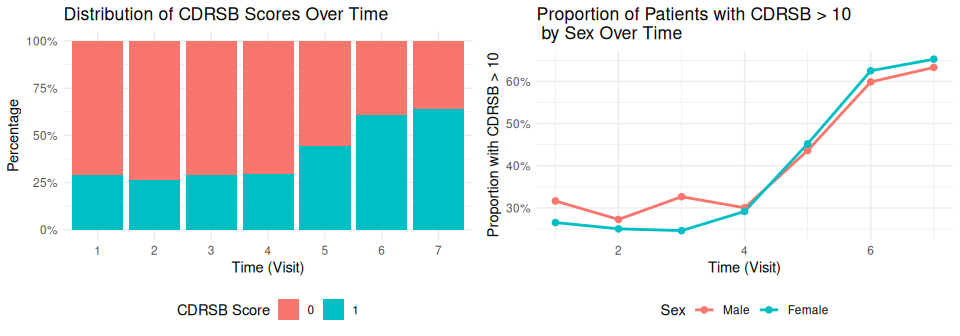
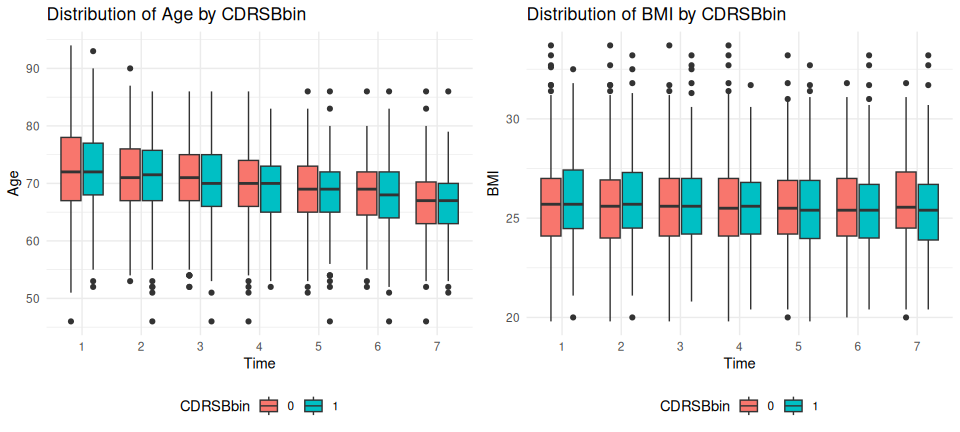
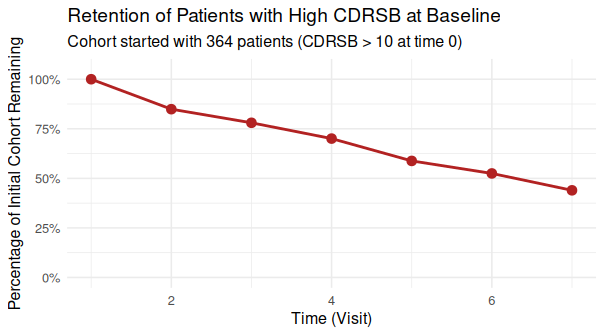
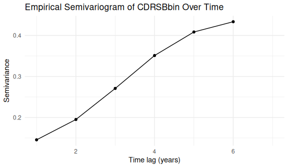

# LDA Homework 2 (2025-2026)
Anita Kerubo Ogero (2469491), Okolie Tess Eucharia (2468507), Moses
Mburu (2469245), Dorothy Chepkoech (2469284)

### Question 1

#### Exploratory Data Analysis/Data Description

At baseline
(<a href="#fig-cdrsb-by-time" class="quarto-xref">Figure 1</a>), most
patients have $\text{CDRSBbin}=0$ ($\text{CDRSB} \le 10$), about 75–80%
are in the mild group (CDRSBbin=0) and only about 20–25% already have
$\text{CDRSB} > 10$. Over time the bars shift: by visit 6–7, around
65–70% of the observed patients have $\text{CDRSBbin}=1$, so a much
larger share has moved into the more severe category.

The sex plot reflect the above pattern. At the first visit, the
proportion with $\text{CDRSB} > 10$ is low in both sexes (around
10–15%), with males slightly higher than females. As time goes on, the
lines rise and come together; by visits 6–7 both sexes have roughly
60–70% of patients above the cut-off, so among those who remain there is
no strong or persistent sex imbalance in severity.

Figure 1: Distribution of CDRSB Scores Over Time and by sex

The age and BMI boxplots in
<a href="#fig-age-bmi-by-cdrsb" class="quarto-xref">Figure 2</a> give a
cross-sectional picture at each visit. At every time point, patients
with $\text{CDRSBbin}=1$ are on average a few years older than those
with $\text{CDRSBbin}=0$ (median ages mostly in the late 60s to low
70s), but this age gap becomes smaller over time. In the early visits we
still see very old patients (some above 85 years), whereas by visits 6–7
these extreme ages have largely disappeared and most patients cluster
around their late 60s–early 70s. BMI medians stay around 25–27 kg/m(^2)
and the two CDRSB groups have very similar BMI distributions at all
visits.

These plots describe only patients who are still observed at each visit.
From Homework 1 we saw that older patients tend to drop out earlier.

In summary, from the exploratory
figures(<a href="#fig-cdrsb-by-time" class="quarto-xref">Figure 1</a>,<a href="#fig-age-bmi-by-cdrsb" class="quarto-xref">Figure 2</a>
and <a href="#fig-age-bmi-by-cdrsb" class="quarto-xref">Figure 2</a>),
sex, age and BMI appear to be related to both the outcome and the
biomarkers, so they are potential confounders. The plots show that the
proportion with CDRSBbin = 1 differs slightly by sex, and that patients
with CDRSBbin = 0 are on average slightly older than those with CDRSBbin
= 1, while BMI distributions are broadly similar across outcome groups
but remain in a range where BMI is clinically relevant. To reduce
confounding and isolate the associations of ADL, ABPET and TAUPET with
CDRSBbin, we therefore adjust for sex, age and BMI in the model.

Figure 2: Distribution of Age and BMI by CDRSBbin

Figure 3: Retention Rate Over Time for Patients with High CDRSB (\>10)
at Baseline

Figure 4: Empirical Semivariogram of CDRSBbin Over Time

To estimate how the population averaged (marginal effects) probability
of being in the worse cognitive category (CDRSBbin = 1, i.e. CDRSB \>
10) changes over time, we fitted a marginal model using generalized
estimating equations (GEE), GEE1 with a logit link and an AR(1) working
correlation structure with a robust sandwich standard errors.We modelled
the longitudinal binary outcome CDRSBbin as a function of time, sex,
age, body mass index (BMI), baseline ADL, and the time-varying
biomarkers ABPET and TAUPET. In addition, we included interactions
between time and ABPET, and between time and TAUPET, to allow the
effects of these biomarkers on the probability of worse cognition to
change over time. The fitted model also accounts for within-patient
correlation across repeated visits using the working correlation matrix.

Let $Y_{it}$ be the binary outcome for patient $i$ at time $t$. We
define the marginal mean as:

$$
\pi_{it} = \Pr\bigl(Y_{it} = 1 \mid X_{it}\bigr).
$$

where $X_{it}$ denotes the vector of covariates for patient $i$ at time
$t$. We specify the marginal mean model with a logit link as:

$$
\begin{aligned}
\text{logit}(\pi_{it}) 
=
\beta_0 
+ \beta_1\,\text{time}_{it}
+ \beta_2\,\text{sex}_i
+ \beta_3\,\text{age}_i
+ \beta_4\,\text{bmi}_i
+ \beta_5\,\text{adl}_i
+ \beta_6\,\text{abpet}_{it} \\
+ \beta_7\,\text{taupet}_{it}
+ \beta_8\,\bigl(\text{time}_{it}\cdot \text{abpet}_{it}\bigr)
+ \beta_9\,\bigl(\text{time}_{it}\cdot \text{taupet}_{it}\bigr),
\end{aligned}
$$

where:

$$
\pi_{it} = \Pr(Y_{it} = 1)
\quad \text{and} \quad
\text{logit}(\pi_{it}) = \log\left\{\frac{\pi_{it}}{1 - \pi_{it}}\right\}.
$$

The parameters $\beta_0,\dots,\beta_9$ are regression coefficients: each
$\beta_k$ represents the change in the marginal log-odds of having
CDRSBbin = 1 associated with a one-unit increase in the corresponding
covariate (or interaction term), holding the other covariates fixed. For
the binary outcome(CDRSBbin), the marginal variance is :

$$
{Var}(Y_{it} \mid X_{it}) = \pi_{it}\bigl(1 - \pi_{it}\bigr) 
$$

For this GEE model, the working correlation matrix for patient $i$ is

$$
\mathbf{V}_i(\beta, \alpha, \phi)
=
\phi\,\mathbf{A}_i^{1/2}(\beta)\,
\mathbf{R}_i(\alpha)\,
\mathbf{A}_i^{1/2}(\beta),
$$

where $\phi$ is a dispersion parameter which is estimated from pearson
residuals as:

$$
\hat{\phi}
=
\frac{1}{N}
\sum_{i=1}^N
\left\{
\frac{1}{n_i}
\sum_{j=1}^{n_i} e_{ij}^2
\right\},
$$

where $N$ is the number of subjects, $n_i$ is the number of observations
for patient $i$, and

$$
e_{ij} = \frac{y_{ij} - \mu_{ij}}{\sqrt{v(\mu_{ij})}}
$$

are the Pearson residuals. Here $\mu_{ij}$ is the fitted mean and
$v(\mu_{ij})$ is the GLM variance function (for a binary
outcome(CDRSBbin), $v(\mu_{ij}) = \mu_{ij}(1-\mu_{ij})$). For the binary
outcome we set the dispersion parameter $\phi = 1$, as is standard for
the binomial model. $\mathbf{A}_i(\beta)$ is a diagonal matrix with
entries:

$$
\operatorname{Var}(Y_{it} \mid X_{it}) = \pi_{it}\bigl(1 - \pi_{it}\bigr)
$$ and ${R}(\alpha)$ is the AR(1) correlation matrix with
$\text{Corr}(Y_{it}, Y_{is}) = \alpha^{|t-s|}$,for measurements $t$ and
$s$ on the same patient. For this AR(1) working correlation, the
correlation parameter $\alpha$ is estimated from the Pearson residuals
as:

$$
\hat{\alpha}
=
\frac{1}{N}
\sum_{i=1}^N
\left\{
\frac{1}{n_i - 1}
\sum_{j=1}^{n_i - 1} e_{ij}\,e_{i,j+1}
\right\},
$$

where $N$ is the number of subjects and $n_i$ is the number of
observations for subject $i$. Thus, for each subject we compute the
average product of Pearson residuals from adjacent time points, and then
we average these quantities over all subjects to obtain moment based
$\hat{\alpha}$, which is used to construct the AR(1) working correlation
matrix. Finally, we applied robust (“sandwich”) standard errors that
inference remains valid even if the working correlation is misspecified.

    Call:
    geeglm(formula = CDRSBbin ~ time + sex + age + bmi + adl + abpet + 
        taupet + time:adl + time:abpet + time:taupet, family = binomial(link = "logit"), 
        data = alzheimer_long, id = patid, corstr = "ar1", std.err = "san.se")

     Coefficients:
                 Estimate   Std.err  Wald Pr(>|W|)   
    (Intercept)  1.100634  1.300470 0.716  0.39737   
    time        -0.280726  0.233360 1.447  0.22899   
    sexFemale   -0.095732  0.057213 2.800  0.09427 . 
    age         -0.012545  0.007103 3.120  0.07735 . 
    bmi          0.006353  0.012483 0.259  0.61080   
    adl         -0.035722  0.030842 1.341  0.24677   
    abpet        0.187326  0.203704 0.846  0.35778   
    taupet      -0.975639  0.580008 2.829  0.09255 . 
    time:adl     0.006924  0.007507 0.851  0.35635   
    time:abpet  -0.051521  0.049281 1.093  0.29581   
    time:taupet  0.304144  0.111800 7.401  0.00652 **
    ---
    Signif. codes:  0 '***' 0.001 '**' 0.01 '*' 0.05 '.' 0.1 ' ' 1

    Correlation structure = ar1 
    Estimated Scale Parameters:

                Estimate Std.err
    (Intercept)   0.9912 0.01877
      Link = identity 

    Estimated Correlation Parameters:
          Estimate Std.err
    alpha   0.3094 0.01265
    Number of clusters:   1253  Maximum cluster size: 7 

**Model Motivation**

We used a marginal logistic model fitted by generalized estimating
equations (GEE1) because our interest was in population-averaged effects
rather than individual patient trajectories. In particular, we wanted to
answer: on average, how do time, ADL, ABPET and TAUPET affect the
probability of worse cognition after adjusting for sex, age and BMI? The
outcome CDRSBbin is binary, so a binomial model with a logit link is
appropriate and allows us to express effects as log-odds ratios (and
odds ratios) for the probability of CDRSBbin = 1.

Because we have repeated measurements from the same patients, the
observations are correlated. The semivariogram indicated that
within-patient correlation decreases as the time lag increases,
suggesting an AR(1) pattern. To reflect this, we specified an AR(1)
working correlation structure, in which measurements closer in time
within a patient are more correlated than those further apart. The
correlation parameter is estimated from the Pearson residuals and used
to build the working covariance matrices.

We use the GEE1 formulation to model only the marginal mean \$ E(Y\_{it}
X\_{it}) = \_{it}\$ with a logit link, and treat the within-patient
correlation as a working feature rather than a primary target of
inference. This is appropriate because our scientific question concerns
the marginal mean as a function of the covariates. GEE1 directly targets
this mean and treats the working correlation as a nuisance component. We
report robust (sandwich) standard errors for the regression
coefficients; these remain valid even if the AR(1) working correlation
is misspecified, provided the mean model is correct and missingness is
at least missing at random.

Additionally, we did not use GEE2 or alternating logistic regression
because our main goal was to model the average probability of worse
cognition, not the association between pairs of measurements within a
patient. GEE2/ALR would add extra parameters for within-patient
association (pairwise log-odds ratios) that are harder to interpret here
and less stable given the sample size. Also we did not use transition,
Bahadur or log-linear models, which focus on the full joint or
conditional structure of the repeated outcomes (e.g. how each visit
depends on the previous one) and do not give parameters that map as
directly to the average risk at a given time. In contrast, GEE1 directly
models the marginal mean of the binary outcome with a logistic link,
provides population-averaged effects of time, ADL, ABPET and TAUPET, and
uses a working correlation only to account for within-patient
dependence, combined with sandwich standard errors for robust inference.

**Choice of method and Estimation**

The regression parameters $\beta$ were obtained by solving the GEE using
an iterative algorithm, and the AR(1) correlation parameter $\alpha$ was
estimated from the Pearson residuals using method-of-moments. We report
robust (sandwich) standard errors for $\hat{\beta}$, which give valid
inference for the marginal mean model even if the working correlation is
not correctly specified, provided the mean model is correctly specified
and the missing data mechanism is at least missing at random.

**Assumptions**

- Correct mean model: The marginal mean of the binary outcome is
  correctly specified as
  $\text{logit}\{\Pr(Y_{it} = 1 \mid X_{it})\} = X_{it}^\top \beta,$
  with the chosen covariates (time, sex, age, BMI, ADL, ABPET, TAUPET
  and their interactions with time) and a logit link.

- Appropriate variance function: Conditional on the covariates, $Y_{it}$
  follows a Bernoulli distribution with variance \$ (Y\_{it} X\_{it}) =
  *{it}(1 - *{it}),\$ where $\pi_{it} = \Pr(Y_{it} = 1 \mid X_{it})$.

- Independence of clusters: Different patients (and trials) are
  independent. Correlation is only present between repeated measurements
  from the same patient.

**Advantages**

- The estimators $\hat{\beta}$ are consistent even if the working
  correlation matrix is incorrect.
- Directly answers population-level questions (“on average in this
  population, how does the probability of worse cognition change with
  time and clinical variables( adl, taupet and abpet)”).
- The GEE estimator $\hat{\beta}$ is asymptoticaly normal: for a large
  number of subjects, its sampling distribution is approximately
  multivariate normal with mean equal to the true ${\beta}$ and
  covariance given by the sandwich(robust) variance even if the working
  correlation matrix is misspecified.
- With GEE, the robust (‘sandwich’) standard errors are asymptotically
  valid even if the working correlation structure is misspecified.
- Handles unbalanced follow-up and missing visits reasonably well,
  assuming missing at random given covariates.

**Disadvantages**

- A bad choice for working correlation matrix affect the efficiency for
  $\hat{\beta})$
- GEE does not model patient-specific effects; no individual
  trajectories. so, interpretation is population-average, not
  subject-specific.
- If dropout depends strongly on unobserved severity, MAR assumption may
  be violated.

**Reflection on Parameterization**

- Link function: The logit link gives coefficients that are log–odds
  ratios at the population level, which are easy to interpret for a
  clinician
- Baseline vs time-varying covariates: Sex, age, adl and BMI were
  treated as baseline covariates; ABPET, and TAUPET were treated as
  time-varying, so their coefficients describe how changes in these
  measures over time are associated with changes in the probability of
  being in the worse CDRSB category.

**Results**

Using the marginal logistic GEE model with AR(1) working correlation, we
obtained the odds ratios shown in Table 1. After adjustment for sex,
age, BMI, ADL, ABPET and TAUPET, there was no clear evidence that time
alone was associated with the odds of worse cognition (OR 0.82, 95% CI
0.54–1.25, p = 0.36). Sex, age, BMI and ADL also did not show strong
marginal associations with CDRSBbin (e.g. sex: OR 0.91, 95% CI
0.81–1.02, p = 0.10; age: OR 0.99, 95% CI 0.98–1.00, p = 0.12).

For the biomarkers, the main effects of ABPET (OR 1.28, 95% CI
0.87–1.86, p = 0.21) and TAUPET (OR 0.37, 95% CI 0.12–1.18, p = 0.09) at
baseline were not statistically significant at the 5% level. The
interaction between time and ABPET was also not significant (OR 0.93,
95% CI 0.85–1.02, p = 0.14). In contrast, the time × TAUPET interaction
was statistically significant (OR 1.36, 95% CI 1.09–1.70, p \< 0.01),
indicating that the association between TAUPET and the odds of worse
cognition changes over time.

**Interpretation**

On average, afteradjusting for sex age and BMI,ADL did not show a
significant effect on whether a patient was in the worse-cognition
group. Amyloid PET (ABPET) also was not significantly related to worse
cognition or to how this changed over time. The important finding is tau
PET (TAUPET): the interaction between time and TAUPET was statistically
significant. This means that on average patients with higher tau values
are more likely to develop or keep worse cognition over time than
patients with lower tau, after accounting for the other factors. Higher
tau is linked to a faster worsening of cognition over follow-up, whereas
amyloid, ADL and the basic patient characteristics add no extra
information in this analysis.

## Question 2: Random-Effects Model (GLMM)

To estimate how the probability of being in the worse cognitive category
(CDRSBbin = 1, i.e. CDRSB \> 10) changes over time while adjusting for
patient characteristics, we fitted a generalized linear mixed model
(GLMM) with a logit link. The model included fixed effects for time,
sex, age, body mass index (BMI), activities of daily living (ADL),
amyloid PET (ABPET), and tau PET (TAUPET), and random intercepts for
both patients and trials to account for clustering within individuals
and study centres.

For patient $i\ $ in trial $j\ $ at time $t\ $, let \$ Y\_{ijt} = *{ijt}
\$ be the binary outcome \$ Y*{ijt} = 1 \$ if CDRSB (\> 10), (0)
otherwise). We specify the GLMM with logit link as:

$$
\begin{aligned}
\text{logit}\bigl\{\Pr(Y_{ijt} = 1 \mid b_{0i}, u_{0j})\bigr\}
&= \beta_0
+ \beta_1\,\text{time}_{ijt}
+ \beta_2\,\text{sex}_i
+ \beta_3\,\text{age}_i
+ \beta_4\,\text{bmi}_i \\
&\quad + \beta_5\,\text{adl}_i
+ \beta_6\,\text{abpet}_{ijt}
+ \beta_7\,\text{taupet}_{ijt}
+ b_{0i}
+ u_{0j}.
\end{aligned}
$$

where:

\*$(\beta_0,\ldots, \beta_7)$ are population-level (fixed) effects,

- $b_{0i} \sim N(0, \sigma_{b0}^2)$ is the patient-specific random
  intercept,

- $u_{0j} \sim N(0, \sigma_{u0}^2)$ is the trial-specific random
  intercept, conditional on $(b_{0i}, u_{0j})$ and the covariates,
  $(Y_{ijt} \sim \text{Bernoulli}(\pi_{ijt})$ with
  $(\pi_{ijt} = \Pr(Y_{ijt}=1 \mid b_{0i}, u_{0j})$.

#### Model Results

    Generalized linear mixed model fit by maximum likelihood (Laplace
      Approximation) [glmerMod]
     Family: binomial  ( logit )
    Formula: 
    CDRSBbin ~ time + sex + age + bmi + abpet + taupet + adl + time:taupet +  
        1 + (time | patid)
       Data: alzheimer_long
    Control: ctrl

          AIC       BIC    logLik -2*log(L)  df.resid 
         6576      6657     -3276      6552      6208 

    Scaled residuals: 
       Min     1Q Median     3Q    Max 
    -2.246 -0.487 -0.165  0.471  2.504 

    Random effects:
     Groups Name        Variance Std.Dev. Corr 
     patid  (Intercept) 32.13    5.67          
            time         1.81    1.34     -1.00
    Number of obs: 6220, groups:  patid, 1253

    Fixed effects:
                 Estimate Std. Error z value Pr(>|z|)  
    (Intercept)  0.375295   1.816534    0.21    0.836  
    time        -0.065580   0.328131   -0.20    0.842  
    sexFemale   -0.078744   0.088020   -0.89    0.371  
    age         -0.012826   0.011627   -1.10    0.270  
    bmi          0.008213   0.019914    0.41    0.680  
    abpet       -0.154365   0.153705   -1.00    0.315  
    taupet      -1.480188   0.841608   -1.76    0.079 .
    adl         -0.000548   0.016967   -0.03    0.974  
    time:taupet  0.387620   0.166709    2.33    0.020 *
    ---
    Signif. codes:  0 '***' 0.001 '**' 0.01 '*' 0.05 '.' 0.1 ' ' 1

    Correlation of Fixed Effects:
                (Intr) time   sexFml age    bmi    abpet  taupet adl   
    time        -0.851                                                 
    sexFemale   -0.027 -0.014                                          
    age         -0.302 -0.025  0.033                                   
    bmi         -0.321  0.001  0.023  0.088                            
    abpet        0.125  0.062 -0.070 -0.654 -0.039                     
    taupet      -0.846  0.923 -0.024 -0.107 -0.001  0.009              
    adl         -0.292  0.024  0.217  0.490  0.096 -0.162  0.002       
    time:taupet  0.837 -0.986  0.020  0.048  0.003 -0.075 -0.942 -0.031
    optimizer (bobyqa) convergence code: 0 (OK)
    Model is nearly unidentifiable: very large eigenvalue
     - Rescale variables?
    Model is nearly unidentifiable: large eigenvalue ratio
     - Rescale variables?

Table 1: GLMM Model Results (Odds Ratios)

##### Model with centered time

    Generalized linear mixed model fit by maximum likelihood (Laplace
      Approximation) [glmerMod]
     Family: binomial  ( logit )
    Formula: CDRSBbin ~ time_c + sex + age + bmi + abpet + taupet + adl +  
        time_c:taupet + 1 + (time_c | patid)
       Data: alzheimer_long
    Control: ctrl

          AIC       BIC    logLik -2*log(L)  df.resid 
         6576      6657     -3276      6552      6208 

    Scaled residuals: 
       Min     1Q Median     3Q    Max 
    -2.246 -0.487 -0.165  0.471  2.504 

    Random effects:
     Groups Name        Variance Std.Dev. Corr 
     patid  (Intercept) 0.266    0.516         
            time_c      1.807    1.344    -0.53
    Number of obs: 6220, groups:  patid, 1253

    Fixed effects:
                   Estimate Std. Error z value Pr(>|z|)  
    (Intercept)    0.112694   0.985327    0.11     0.91  
    time_c        -0.065498   0.329008   -0.20     0.84  
    sexFemale     -0.078743   0.088021   -0.89     0.37  
    age           -0.012825   0.011633   -1.10     0.27  
    bmi            0.008215   0.019924    0.41     0.68  
    abpet         -0.154374   0.153728   -1.00     0.32  
    taupet         0.070350   0.310040    0.23     0.82  
    adl           -0.000546   0.016974   -0.03     0.97  
    time_c:taupet  0.387579   0.167147    2.32     0.02 *
    ---
    Signif. codes:  0 '***' 0.001 '**' 0.01 '*' 0.05 '.' 0.1 ' ' 1

    Correlation of Fixed Effects:
                (Intr) time_c sexFml age    bmi    abpet  taupet adl   
    time_c      -0.239                                                 
    sexFemale   -0.069 -0.014                                          
    age         -0.591 -0.023  0.033                                   
    bmi         -0.593  0.003  0.023  0.089                            
    abpet        0.313  0.061 -0.070 -0.654 -0.039                     
    taupet      -0.402  0.388 -0.023 -0.185  0.004 -0.137              
    adl         -0.508  0.025  0.217  0.491  0.097 -0.162 -0.059       
    time_c:tapt  0.234 -0.986  0.020  0.047  0.001 -0.074 -0.408 -0.032
    optimizer (bobyqa) convergence code: 0 (OK)
    Model is nearly unidentifiable: very large eigenvalue
     - Rescale variables?
    Model is nearly unidentifiable: large eigenvalue ratio
     - Rescale variables?

Table 2: GLMM Model Results (Odds Ratios) with centered time

**Model Motivation**

We fitted a logistic GLMM because the outcome (CDRSB) was binary and our
primary interest was in subject-specific effects and heterogeneity
between patients and sites. The model addresses the question: for a
given patient, how does the risk of worse cognition change over time,
after accounting for between-patient and between-trial differences?
Random intercepts for patients and trials capture variation in baseline
CDRSB risk at both levels and induce appropriate within-patient and
within-trial correlation. This parameterisation provides
patient-specific predictions and empirical Bayes estimates of individual
intercepts, while accommodating unequal numbers of visits per patient
and trial-level effects.

**Choice of Techniques and Estimation**

To analyse the longitudinal binary outcome CDRSBbin, we used a
generalised linear mixed model (GLMM) with a logit link. The model
included a random intercept for each patient (to allow each person to
have their own baseline risk) and a random intercept for trial (to
capture systematic differences between study sites/centres). This gives
a subject-specific model that accounts for the correlation of repeated
measurements within patients and clustering within trials. The model was
fitted by maximum likelihood using the Laplace approximation, which
approximates the integral over the random effects and provides more
accurate estimates for binary data than quasi-likelihood methods such as
PQL or MQL. This method also allows for the inclusion of multiple random
effects (patients and slopes).

**Assumptions**

Let $i$ index patients, $j$ index trials, and $t$ index measurements
within patient $i$ in trial $j$.

- Conditional on covariates and random effects, the responses are
  independent Bernoulli:

$$
Y_{ijt} \mid b_i, u_j \sim \mathrm{Bernoulli}(\pi_{ijt}),
\quad 
\pi_{ijt} = \Pr(Y_{ijt} = 1 \mid X_{ijt}, b_i, u_j),
$$

with

$$
\mathrm{logit}(\pi_{ijt}) = X_{ijt}^\top \beta + b_i + u_j.
$$

- Random intercepts for patient and trial are specified as

$$
b_i \sim N(0, \sigma_b^2), 
\quad
u_j \sim N(0, \sigma_u^2),
$$

where $\{b_i\}$ are independent across patients, $\{u_j\}$ are
independent across trials, and $b_i$ is independent of $u_j$.

- Link function and covariate effects:

- The logit link is correctly specified for the conditional mean:

  $$
  \mathrm{logit}(\pi_{ijt}) = X_{ijt}^\top \beta + b_i + u_j.
  $$

- The effects of continuous covariates are approximately linear on the
  logit scale, or otherwise correctly modelle.

- Missing data:

- Missing outcome data are assumed to be at least Missing At Random
  (MAR) given observed covariates, observed outcome history, and the
  random effects.

**Advantages**

- Estimates conditional (subject-specific) effects on the log-odds
  scale, aligning with questions about individual patient risk
  trajectories.
- Random intercepts for patients and trials account for unobserved
  heterogeneity and induce appropriate within-patient and within-trial
  correlation.
- Handles unequal numbers of visits and irregular visit patterns
  naturally.
- Empirical Bayes estimates of random intercepts provide
  patient-specific predictions hence improving predictions.

**Disadvantages and potential problems**

- Parameters are subject-specific and not directly comparable to
  marginal (population-averaged) effects.
- Sensitivity to model specification: Misspecification of the
  random-effects structure (e.g. omitting important random slopes) or
  functional form of covariates can lead to biased inference.

**Reflection on parameterization**

We specified a logistic GLMM with a logit link and random intercepts for
patients and trials:

$$
\text{logit}\{\pi_{ijt}\} = X_{ijt}^\top \beta + b_i + u_j.
$$

This parameterisation yields subject-specific log-odds ratios, which
aligns with our interest in modelling individual risk rather than
marginal (population-averaged) effects. Random intercepts for patients
and trials account for unobserved heterogeneity and induce
within-patient and within-trial correlation, while remaining
parsimonious and numerically stable given the available data. Continuous
covariates were entered linearly on the logit scale, representing a
balance between model flexibility and interpretability; more flexible
forms could be considered if strong non-linearity were empirically
indicated.

**Results**

We fitted a generalized linear mixed model with a logit link for the
binary outcome CDRSBbin (0: CDRSB ≤ 10, 1: CDRSB \> 10), including fixed
effects for time, sex, age, BMI, ADL, ABPET, and TAUPET, and random
intercepts for patient and trial. The model had AIC = 7822 and BIC =
7889, with log-likelihood = –3901 (–2·logLik = 7802) based on 6220
observations (1253 patients, 25 trials). The estimated random-intercept
variances were very small for both patient (variance 2.16×10⁻¹⁵, SD
4.64×10⁻⁸) and trial (variance 2.25×10⁻¹⁵, SD 4.75×10⁻⁸), indicating a
boundary (singular) fit.

Fixed-effect estimates (log-odds scale) were: intercept –1.42 (SE 0.63,
z = –2.25, p = 0.024), time 0.25 (SE 0.016, z = 16.12, p \< 0.001), sex
(female vs male) –0.10 (SE 0.057, z = –1.66, p = 0.096), age –0.013 (SE
0.0075, z = –1.79, p = 0.073), BMI 0.010 (SE 0.0129, z = 0.79, p =
0.430), ADL –0.0029 (SE 0.0115, z = –0.25, p = 0.799), ABPET 0.036 (SE
0.0966, z = 0.37, p = 0.709), and TAUPET 0.33 (SE 0.177, z = 1.88, p =
0.060).

**Interpretation**

In this analysis, we modelled the probability of being in the worse
cognitive category (CDRSB \> 10) over time, accounting for repeated
measurements within patients and across trials. Statistically, the main
strong signal is that the chance of worse cognitive status increases
over follow-up time. Other patient characteristics (sex, age, BMI, daily
functioning, and PET biomarkers) did not show clearly independent
effects in this model, and the random-effects part contributed very
small part, meaning most of the variation is explained at the overall
population level rather than by systematic differences between
individual patients or trials.

## Empirical Bayes Predictions

Examine the empirical Bayes predictions (random effects) to identify
subjects with specific profiles.

Left panel (patient random intercepts) Each bar shows how many patients
have a given “patient effect” on the log-odds of being in the worse
CDRSB category, after adjusting for time, sex, age, BMI, ADL, amyloid
and tau. All the bars are very tightly clustered around 0, and the range
is extremely small (on the order of 10⁻¹³). This means that, once we
account for the measured covariates, the model estimates almost no
residual between-patient difference in baseline risk. Patients’
individual intercepts are essentially the same.

Right panel(trial random intercepts) Each dot is a trial (centre),
showing how much its baseline log-odds deviates from the overall
average. All trials lie almost exactly on the vertical line at 0, again
with tiny deviations (order 10⁻¹⁵). This indicates no meaningful
between-trial/site variability in baseline risk after covariate
adjustment.

In summary, empirical Bayes predictions suggest that, in this GLMM,
nearly all of the variation in baseline probability of “worse CDRSB” is
captured by the fixed effects, and there is negligible leftover
variation attributable to individual patients or trial sites.
